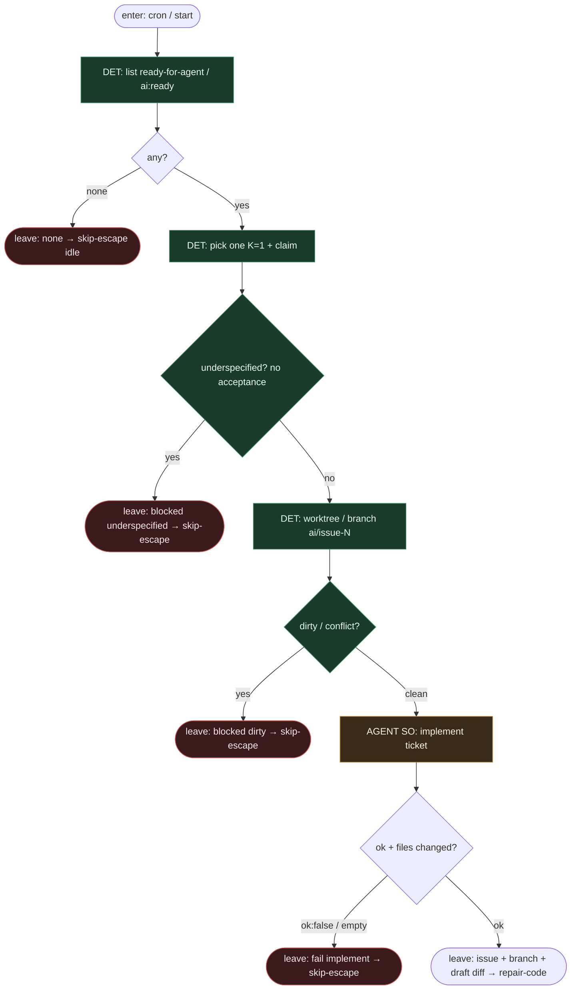

# Subgraph: intake

**Theme:** pick labeled → worktree/branch → pierwsze `implement`. Wejście do łańcucha bounded repair.  
**Mode mix:** DET front door; jeden AGENT SO `implement`. Zero repair tutaj — to robi `repair-code`.

## Flow



## Notes

- **K=1 occupancy.** Jeden ticket naraz. Occupancy DET; agent nie „bierze z czatu”.
- **Ticket jasny albo skip.** Brak acceptance / verification → `underspecified` → skip-escape. Nie planuj aż będzie sens (to wariant 19, nie planner).
- **Dirty = blocked.** Pessimista nie zaczyna na brudnym drzewie; receipt, nie limbo.
- **Implement ≠ repair.** Pierwszy SO tylko kładzie draft. Lokalny test i `repair_code` są w następnym podgrafie — żeby licznik N był jawny.
- **Handoff.** `{issue_id, branch, worktree, draft_summary, files[], repair_code_used:0}` albo `{blocked|none, reason}` → skip-escape.

## Structured output — `implement`

```json
{
  "ok": true,
  "summary": "add null guard in Foo.bar",
  "files": ["src/foo.py", "tests/test_foo.py"]
}
```

```json
{ "ok": false, "reason": "cant_comply|needs_split|blocked_path|empty" }
```
