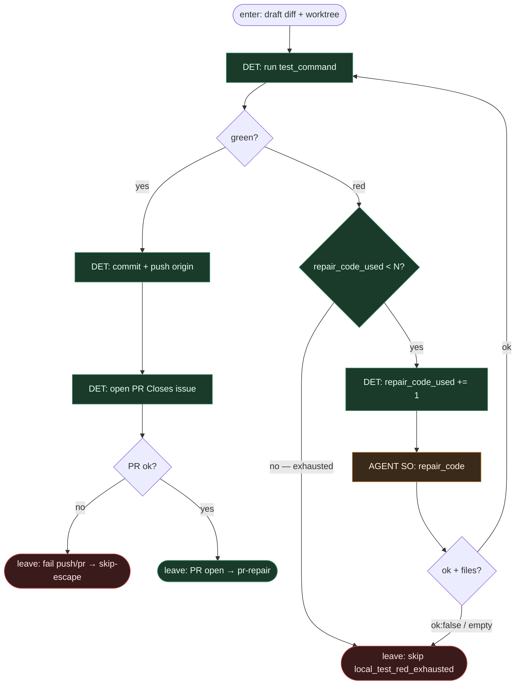

# Subgraph: repair-code

**Theme:** lokalny test jako wyrocznia; przy red → `repair_code` max N; po wyczerpaniu → skip (nie limbo).  
**Mode mix:** DET test + counter; AGENT SO `repair_code` w liściu. To jest **pierwszy** bounded loop wariantu.

## Flow



## Notes

- **Test jest wyrocznią.** `test_command` z ticketa / repo. Model nie przewiduje zieloności zamiast runnera.
- **N jest twarde.** Default N=2 (MANIFEST). Po `repair_code_used >= N` → **natychmiast** skip-escape z `local_test_red_exhausted`. Żadnego „jeszcze raz”.
- **Counter DET.** Agent dostaje `{attempt, n_max, last_failure_log}`; nie wolno mu pisać do licznika.
- **Jeden liść, jeden slot.** `repair_code` = wąski SO na czerwony log + diff. Nie zagnieżdżony SDLC, nie multi-sample catalogue (to wariant 07).
- **Nie otwieraj PR na czerwono.** Commit/push/PR tylko po green. Pessimista woli skip niż czerwony CI theatre.
- **ok:false w środku budżetu = skip.** Nie spalaj reszty N na puste naprawy — fail-closed.
- **Handoff.** `{pr_url, branch, head_sha, repair_code_used}` | `{fail:true, reason: local_test_red_exhausted|push_fail|pr_open_fail, repair_code_used}`.

## Structured output — `repair_code`

```json
{
  "ok": true,
  "attempt": 1,
  "summary": "fix assertion: expect 404 not 500",
  "files": ["src/foo.py", "tests/test_foo.py"]
}
```

```json
{ "ok": false, "attempt": 2, "reason": "cant_fix|needs_product_decision|blocked_path" }
```
