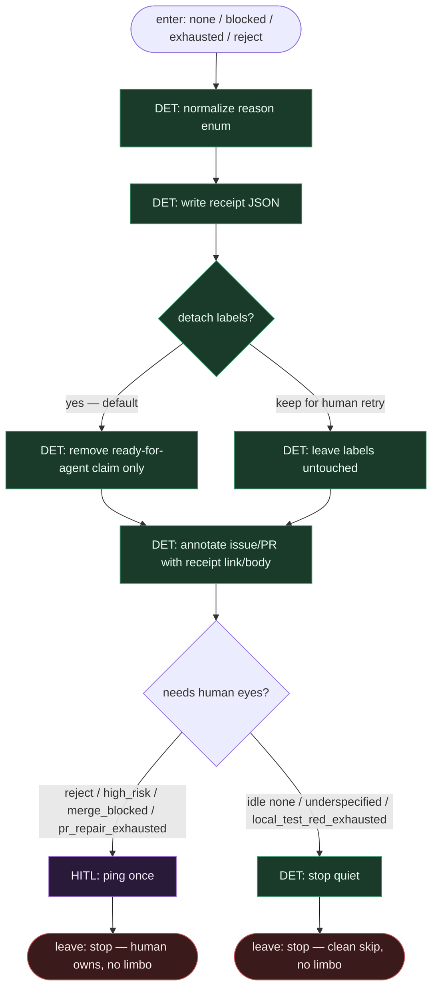

# Subgraph: skip-escape

**Theme:** po wyczerpaniu N (lub blocked intake) → **skip z receipt**, opcjonalny HITL ping. **Żadnych limbo stamps.**  
**Mode mix:** 100% DET (+ HITL ping). Escape hatch całego wariantu 19.

## Flow



## Reason enum (closed) — limbo **never**

| reason | Typical source | Default exit | Limbo stamp? |
|--------|----------------|--------------|--------------|
| `idle_none` | intake: brak labeled | quiet stop | **never** |
| `underspecified` | intake | quiet stop | **never** |
| `dirty_worktree` | intake | quiet stop | **never** |
| `implement_fail` | intake SO | quiet stop | **never** |
| `local_test_red_exhausted` | repair-code N | quiet stop + receipt | **never** |
| `push_fail` / `pr_open_fail` | repair-code | quiet stop | **never** |
| `ci_red` / `ci_timeout` | pr-repair | stop + annotate PR | **never** |
| `review_reject` | pr-repair | HITL ping | **never** |
| `pr_repair_exhausted` | pr-repair N | HITL ping; PR left open | **never** |
| `merge_blocked` | pr-repair policy | HITL ping | **never** |
| `high_risk` | classify gate | HITL ping | **never** |

## Receipt shape

```json
{
  "outcome": "skipped",
  "reason": "pr_repair_exhausted",
  "issue_id": 42,
  "pr_url": "https://github.com/org/repo/pull/7",
  "repair_code_used": 1,
  "pr_repair_used": 2,
  "n_repair_code": 2,
  "n_pr_repair": 2,
  "ts": "2026-09-11T09:51:00Z",
  "next": "human",
  "limbo_label": null
}
```

## Notes

- **Skip ≠ limbo.** Limbo stamp odkłada wstyd na tablicy. Tu: audytowalny receipt + stop. Człowiek czyta reason, nie zgaduje z etykiety.
- **Zakazane labele.** `ai:deferred`, `ai:limbo`, `needs-human-maybe`, `workflow:limbo`, `waiting-forever` — nielegalne w tym wariancie. Jedyny „human” sygnał = HITL ping + opcjonalnie istniejący `workflow:needs-human` **tylko** gdy policy to przewiduje jako jawny hold — nadal nie limbo.
- **Detach claim, nie stamp.** Default: zdejmij claim/`ready-for-agent` occupancy, żeby inny worker nie gnił w pętli. Nie doklejaj „deferred”.
- **PR left open przy exhausted pr_repair.** Diff i review comments zostają — to artefakt dla człowieka, nie stan „agent jeszcze wróci”.
- **Jeden ping HITL.** Bez nudge-loop. Pessimista nie spamuje.
- **Top-level łączy tu wszystkie `none` / `blocked` / `exhausted` / `reject`.** Bez tego podgrafu bounded N kończy się w powietrzu.
- **Handoff.** `{skipped:true, receipt}` | `{human_hold:true, receipt}` — nigdy `{label: "limbo"}`.
