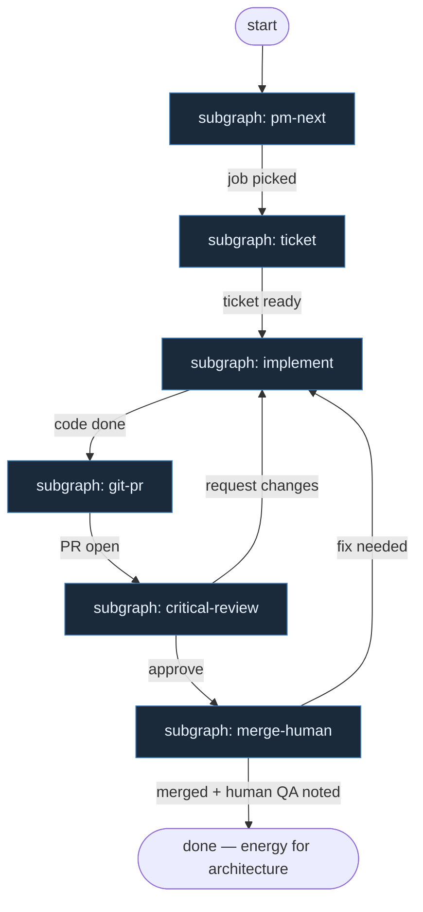

# 20 — From Zero

**Persona:** blank-slate optimistic clarity — invent clean stages from SOUL only; ignore legacy mill names; free human energy for architecture and hard QA.

**Approach:** from_scratch. Independent graph + thematic subgraphs (not one monolith). Polish OK.

## Design notes

- **Start from SOUL, nothing else.** Stages are invented fresh from the soul chain: PM → next job → ticket → implement → git → PR → critical review → merge/fix → human architecture/QA.
- **No mill vocabulary.** No inherited factory/mill labels — only clear stage names anyone can read on day one.
- **DET owns the exhausting middle.** Enter PM, pick next job, normalize ticket, branch, commit, push, open PR, merge — scripts and atoms, not agents.
- **AGENT only where entropy pays.** Implement (how to code this ticket) and critical review (separate role) are AGENT seats; optional light plan stays optional.
- **Meat ≡ AI in the chain.** Same nodes, same handoffs; a human or an agent can sit in an AGENT seat without reshaping the graph.
- **Optimistic clarity.** Every handoff has a small contract; failures stop cleanly; humans keep the valuable work.
- **NOT L5.** Goal is not to remove people — it is to remove exhausting intermediate klepanie so energy goes to architecture and uncomfortable QA questions.
- **Subgraphs by theme.** Where a stage has many small actions → its own subgraph; top-level stays readable.
- **One ticket, one PR.** Thinnest mergeable unit; merge/fix loops back to implement when needed.
- **Human architecture/QA is first-class.** Periodic strategy questions and architecture judgment are an explicit stage — not leftover fluff after merge.

## Top-level flowchart

**DET vs AGENT at a glance**

| Stage | Mode | Responsibility |
|-------|------|----------------|
| PM | DET | Enter project management place |
| Next job | DET | Read / pick next actionable job |
| Ticket | DET (+ light AGENT if unclear) | Process ticket in context → stable payload |
| Implement | AGENT | High-entropy coding judgment |
| Git | DET | Branch, commit(s), push to origin |
| PR | DET | Open pull request |
| Critical review | AGENT | Separate role: consistency, architecture fit, comments |
| Merge / fix | DET (+ loop) | Merge policy or return feedback to implement |
| Human architecture / QA | HUMAN | Energy for hard decisions & uncomfortable questions |

## Index of subgraphs

| File | Theme | Role in chain |
|------|--------|----------------|
| [subgraph-pm-next.md](./subgraph-pm-next.md) | PM → next job | DET front door |
| [subgraph-ticket.md](./subgraph-ticket.md) | Ticket in context | Normalize / ready payload |
| [subgraph-implement.md](./subgraph-implement.md) | Implement | AGENT entropy sink |
| [subgraph-git-pr.md](./subgraph-git-pr.md) | Git → PR | DET branch/commit/push/open PR |
| [subgraph-critical-review.md](./subgraph-critical-review.md) | Critical review | Separate AGENT role |
| [subgraph-merge-human.md](./subgraph-merge-human.md) | Merge/fix → human architecture/QA | DET merge + HUMAN strategy |

## Kryterium sukcesu (z SOUL)

Człowiek ma energię na architekturę i niewygodne pytania — bo nie spalił dnia na: weź ticket → branch → push → otwórz PR → dogadaj merge.

Technicznie: zmergowane `ai/fix` na tipie hosta w sensownym oknie czasu — nie ładny JSON bez skutku.
