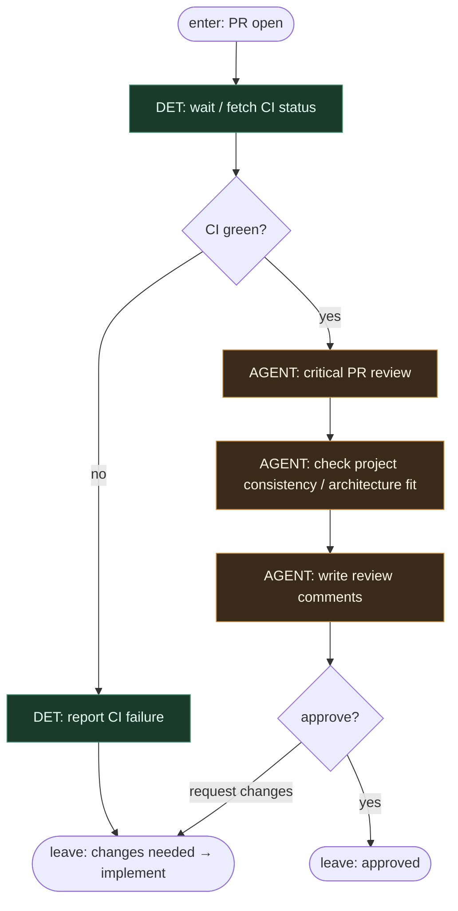

# Subgraph: critical-review

**Theme:** krytyczny przegląd PR — osobna rola (SOUL ciężar nr 3).  
**Mode mix:** AGENT review; DET na status CI.

## Flow

## Notes

- **Separate role from implementer.** Critical review is never the same seat that wrote the diff (meat or AI).
- **Architecture fit unless the PR changes architecture.** Consistency with the project; comments are first-class.
- **CI is DET gate.** No AGENT override of red builds on the clear path.
- **Optimistic clarity.** Approve or request changes — no fuzzy maybe-later state in the graph.
- **Handoff contract.** Output = `{approved: true, pr}` or `{approved: false, feedback}` for merge-human / implement loop.
