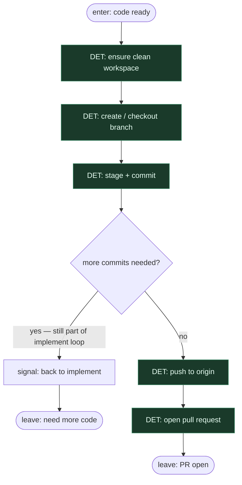

# Subgraph: git-pr

**Theme:** branch → commit(y) → push → otwórz pull request.  
**Mode mix:** wyłącznie DET — deterministic git + PR plumbing.

## Flow

## Notes

- **Clean stages: git then PR.** SOUL steps 5–8 as one DET subgraph with many small atoms.
- **Branch naming is script.** Deterministic from ticket ID + slug — no ad-hoc invention.
- **Commits stay DET.** Message from ticket ID + short summary; no release-note novels unless hooks require.
- **Open PR is DET.** Template + create; no AGENT writing the PR as a second product.
- **If more code is needed,** leave with signal back to implement — do not hide coding inside git.
- **Handoff contract.** Output = `{branch, commit_shas, pr_url}` for critical-review.
