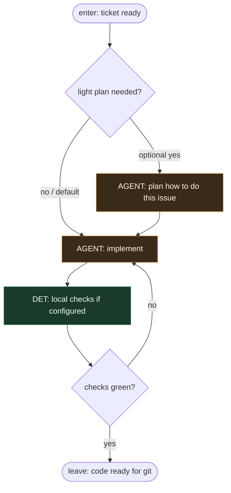

# Subgraph: implement

**Theme:** jak najlepiej zaimplementować — tu wkracza entropia.  
**Mode mix:** AGENT implement; opcjonalny lekki plan; DET tylko na lokalne checki.

## Flow

## Notes

- **This is SOUL ciężar nr 2.** Not a script take-next — judgment on how to implement.
- **Narrow agents OK.** Plan-only or file-breakdown agents are fine; not one fat brain tool-calling everything.
- **Default skips plan.** Optimistic clarity: clear ticket → go straight to implement.
- **Meat ≡ AI.** Same AGENT seat — human or coding agent; graph does not care.
- **No git here.** Branch/commit/push live in git-pr so this subgraph stays about code judgment.
- **Handoff contract.** Output = `{workspace_diff_summary, ready_for_git: true}` for git-pr.
