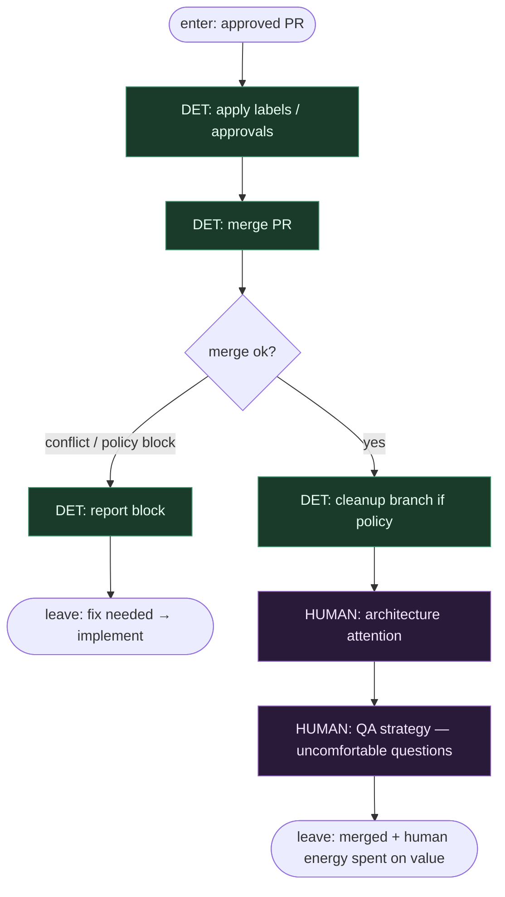

# Subgraph: merge-human

**Theme:** merge albo poprawki → przestrzeń na ludzką architekturę i QA-strategię.  
**Mode mix:** DET merge; HUMAN na architekturę i niewygodne pytania.

## Flow

## Notes

- **Merge is DET after green review.** Labels/checks → merge script; humans intervene on conflict or policy block.
- **Fix loop is honest.** Almost always there are poprawki — leave back to implement with feedback, do not pretend otherwise.
- **Human architecture / QA is the win.** SOUL criterion: person has energy for hard decisions and "czemu tak — nie da się prościej?" because the chain already did the exhausting middle.
- **NOT replacing QA strategy.** Periodic uncomfortable questions stay; good QA engineers gain time, they do not disappear.
- **Success is merged reality.** Tip of host moves in a sensible time window — not pretty JSON without effect.
- **Handoff contract.** Output = `{merged: true, merge_sha, human_notes}` or `{merged: false, feedback}` for re-implement.
