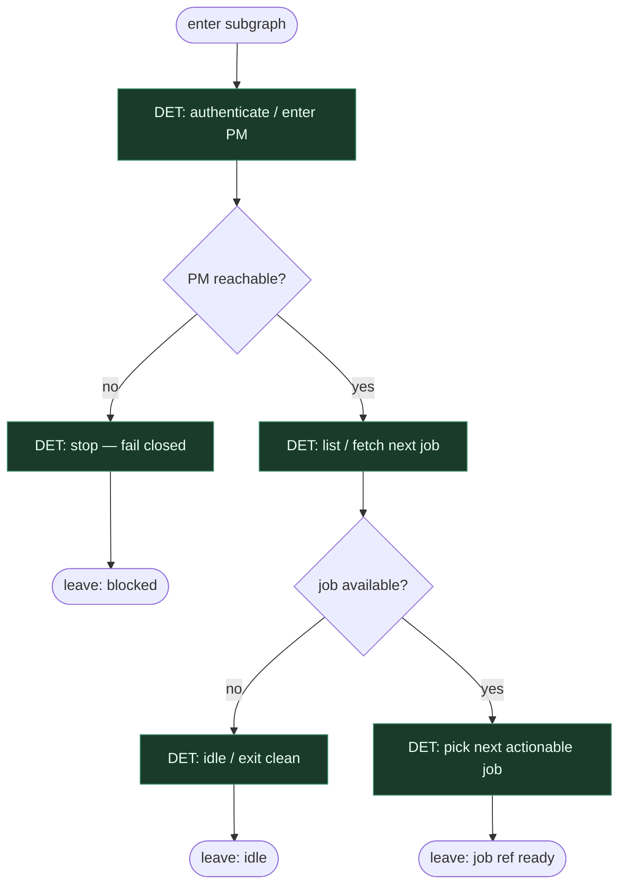

# Subgraph: pm-next

**Theme:** wejście do PM → odczytanie następnej roboty.  
**Mode mix:** prawie wyłącznie DET; zero kodowania.

## Flow

## Notes

- **Blank-slate front door.** Only: enter the project-management place, then read the next job. No mill names, no triage theatre.
- **Optimistic clarity.** If there is no job, leave idle — do not invent work.
- **Fail closed on PM.** Auth / reachability failures stop the chain; no AGENT recovery that hides broken plumbing.
- **Handoff contract.** Output = `{pm_context, job_ref}` for ticket subgraph.
