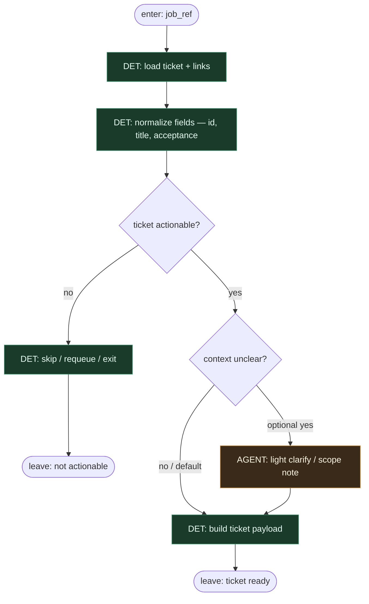

# Subgraph: ticket

**Theme:** przetworzenie ticketu w kontekście → stabilny payload.  
**Mode mix:** DET normalize; opcjonalnie lekki AGENT gdy ticket niejasny.

## Flow

## Notes

- **Clean stage name: ticket.** Process the issue in context — nothing else lives here.
- **Normalize once.** Title, ID, acceptance hints, links become a stable payload for implement.
- **Light clarify is optional.** Default path skips AGENT; only when acceptance is ambiguous.
- **Not epic decomposition.** One actionable ticket or exit — optimistic and thin.
- **Handoff contract.** Output = `{ticket, acceptance, links, base_ref}` for implement.
