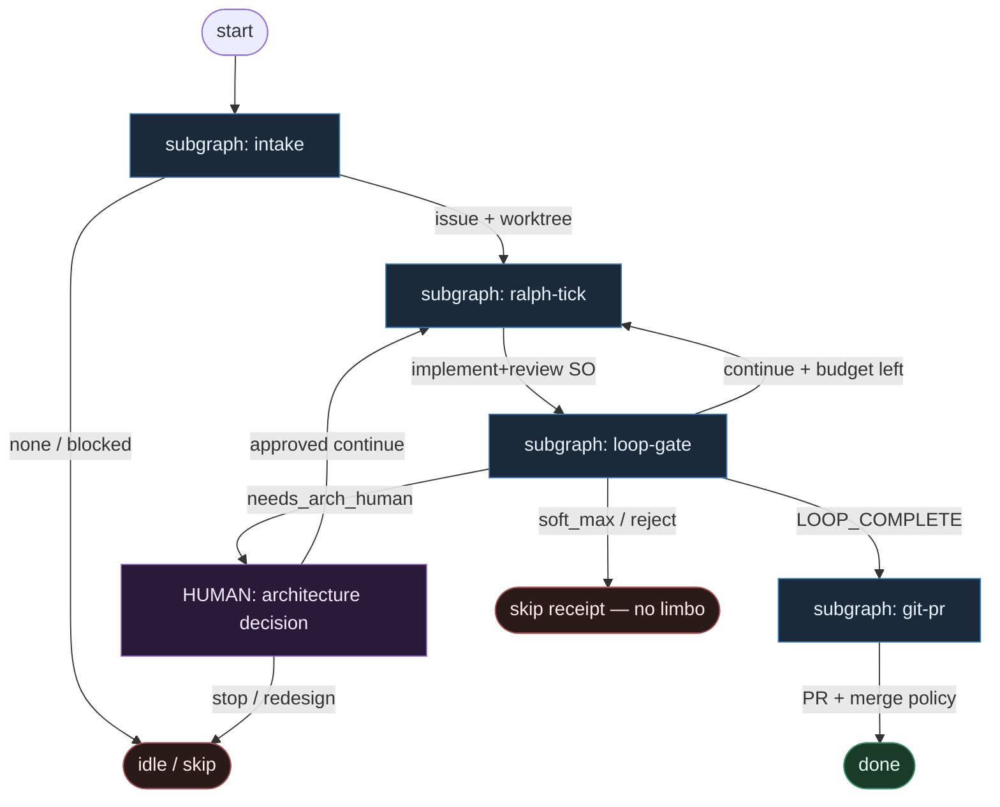

# 21 — Ralph Loop (ralph-wiggum-loop)

**Persona:** ralph-wiggum-loop — ciągłe ticki **implement → review** aż do jawnego `LOOP_COMPLETE`; git/PR zawsze DET; architektura = człowiek; **nie L5**.

**Approach:** compose. Top = ten README; ciało pętli i bramka to osobne podgrafy (nie monolit „wszystko w jednym węźle”).

## Design notes

- **Ralph = pętla, nie fat brain.** Jednostka pracy to **tick**: AGENT `implement_tick` → AGENT `review_tick` (osobna rola). DET tylko liczy ticki i egzekwuje bramkę.
- **`LOOP_COMPLETE` jest sygnałem, nie vibe.** Wychodzi wyłącznie z `review_tick.loop_status` (`continue` | `LOOP_COMPLETE` | `needs_arch_human` | `reject`). Implementer **nie** ogłasza końca pętli.
- **Soft max, nie nieskończoność.** `ralph_tick_used` (DET) ≤ soft_max (default 8). Po wyczerpaniu → arch HITL albo skip z receipt — nigdy limbo, nigdy L5 „klep aż przejdzie w ciemności”.
- **Git/PR poza tickiem, zawsze DET.** Branch / commit / push / open-or-update PR / CI / merge policy żyją w `subgraph-git-pr.md`. Liście SO nie wołają `gh` ani nie merżują.
- **Humans for architecture (SOUL).** Gdy review (lub intake) widzi zmianę architektury / migration / auth / public API → `needs_arch_human`. Człowiek decyduje; agent nie „projektuje systemu w pętli”.
- **Meat ≡ AI.** To samo siedzenie AGENT; topologia się nie zmienia.
- **Jeden ticket, jeden PR.** K=1. Kolejne ticki pushują na ten sam branch; PR otwierany/aktualizowany dopiero gdy bramka puści (lub po partial ship wg compose).
- **NOT L5.** Cel z SOUL: zdjąć wyczerpujące klepanie implement↔review; człowiek zostaje przy architekturze, trudnych decyzjach i (MergePolicy Off) merge.
- **Antyteza bounded-repair (19):** tam twarde N + skip; tu **ciągła** pętla do `LOOP_COMPLETE`, ale z DET soft-max i arch HITL zamiast lights-out.

## Top-level flowchart



**DET vs AGENT at a glance**

| Layer | Mode | Responsibility |
|-------|------|----------------|
| Intake pick + worktree | DET | labeled issue, K=1, branch |
| `implement_tick` | AGENT SO | wąski diff wg acceptance; bez PR |
| `review_tick` | AGENT SO | osobna rola; `loop_status` + reasons |
| Tick counter / soft max | DET | `ralph_tick_used`; agent nie resetuje |
| Loop gate | DET | mapuje `loop_status` → continue / complete / HITL / skip |
| Architecture | HUMAN | SOUL: ludzie dla architektury |
| Git / PR / merge | DET | commit, push, open/update PR, CI, MergePolicy |

## Index of subgraphs

| File | Theme | Role in chain |
|------|--------|----------------|
| [subgraph-intake.md](./subgraph-intake.md) | pick → worktree | DET front door |
| [subgraph-ralph-tick.md](./subgraph-ralph-tick.md) | implement → review (jeden tick) | ciało pętli Ralph |
| [subgraph-loop-gate.md](./subgraph-loop-gate.md) | `LOOP_COMPLETE` / continue / arch HITL | DET predicate + human arch |
| [subgraph-git-pr.md](./subgraph-git-pr.md) | commit → push → PR → merge policy | **All git/PR DET** |

## Structured output (liście w ticku)

### implement_tick

```json
{
  "ok": true,
  "tick": 3,
  "summary": "...",
  "files_touched": ["..."],
  "tests_run_locally": true,
  "acceptance_progress": ["done:...", "todo:..."]
}
```

albo `{ "ok": false, "reason": "cant_comply"|"needs_split"|"blocked_path"|"needs_arch" }`.

### review_tick

```json
{
  "verdict": "approve_progress"|"changes"|"reject",
  "loop_status": "continue"|"LOOP_COMPLETE"|"needs_arch_human"|"reject",
  "reasons": ["..."],
  "risk": "low"|"high",
  "arch_flags": []
}
```

- `LOOP_COMPLETE` tylko gdy acceptance ticketa jest spełnione **i** risk≠blokujący arch bez HITL.
- `needs_arch_human` gdy `arch_flags` niepuste (architecture_change, migration, auth, public_api, …).
- Implementer **nie** ustawia `loop_status`.

## Kryterium sukcesu

Człowiek ma energię na architekturę i niewygodne pytania — bo DET klepie pętlę i gita. Technicznie: po `LOOP_COMPLETE` otwarty (i opcjonalnie zmergowany wg MergePolicy) `ai/PR` na tipie hosta; albo świadomy skip/HITL po soft-max — **nigdy** limbo i **nigdy** L5 lights-out.
