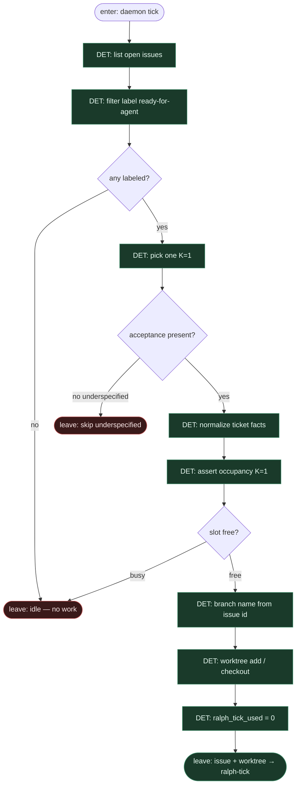

# Subgraph: intake

**Theme:** wejdź do PM → weź **jeden** labeled ticket → worktree/branch.  
**Mode mix:** wyłącznie DET. Agent nie wybiera roboty (SOUL + compose).

## Flow

## Notes

- **Intake = skrypty.** Zero LLM przed pick. Ralph nie „szuka sobie roboty z czatu”.
- **K=1.** Jeden ticket, jeden przyszły PR; occupancy DET blokuje równoległe Ralph-pętle na tym samym repo (domyślnie).
- **Acceptance jest kontraktem pętli.** Bez kryteriów → skip, nie „agent wymyśli DONE”.
- **Licznik startuje na 0.** `ralph_tick_used` żyje w stanie grafu; implement/review go nie resetują.
- **Arch hint (opcjonalny DET).** Jeśli label/tytuł zawiera migration/auth/api — można od razu podnieść flagę pod późniejszy HITL; nie zastępuje review.
- **Handoff.** `{issue_id, acceptance[], branch, worktree, ralph_tick_used:0}` | `{idle:true}` | `{skip:true, reason:underspecified}`.
