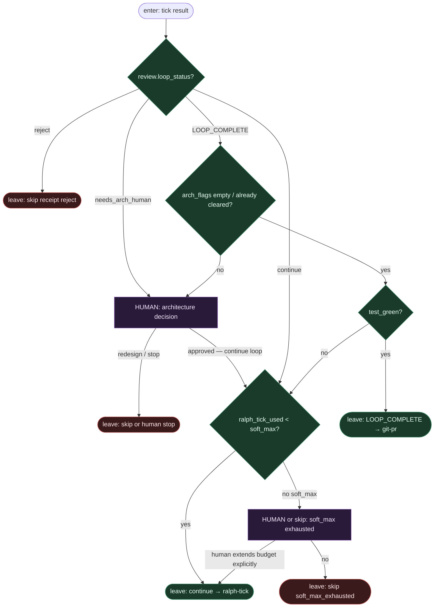

# Subgraph: loop-gate

**Theme:** DET predicate na wyniku ticka — **continue / LOOP_COMPLETE / arch HITL / skip**.  
**Mode mix:** DET bramka + HUMAN przy architekturze. Zero LLM w orkiestracji.

## Flow

## Notes

- **Bramka jest DET.** Mapowanie `loop_status` → krawędź grafu jest twarde; agent nie routuje „co dalej”.
- **`LOOP_COMPLETE` ≠ merge.** Complete tylko puszcza do `subgraph-git-pr.md`. Merge zostaje MergePolicy (Off domyślnie) — SOUL / not L5.
- **Soft max chroni przed Ralph forever.** Default 8 (MANIFEST). Przedłużenie budżetu = **jawny człowiek**, nie prompt „jeszcze trochę”.
- **Architecture = humans.** `needs_arch_human` albo niepuste `arch_flags` przy complete → HITL. Agent nie zatwierdza migracji / auth / public API sam.
- **Zielony test wymagany przy complete.** Jeśli review krzyczy COMPLETE na czerwono — wróć do continue (fail-closed), nie otwieraj PR.
- **Skip z receipt, nie limbo.** Powody: `reject`, `soft_max_exhausted`, `human_stop`. Zakazane: `ai:deferred`, `needs-human-maybe`, limbo theatre.
- **Handoff.** `{action: continue|git_pr|skip|human_wait, ralph_tick_used, reason?}`.
