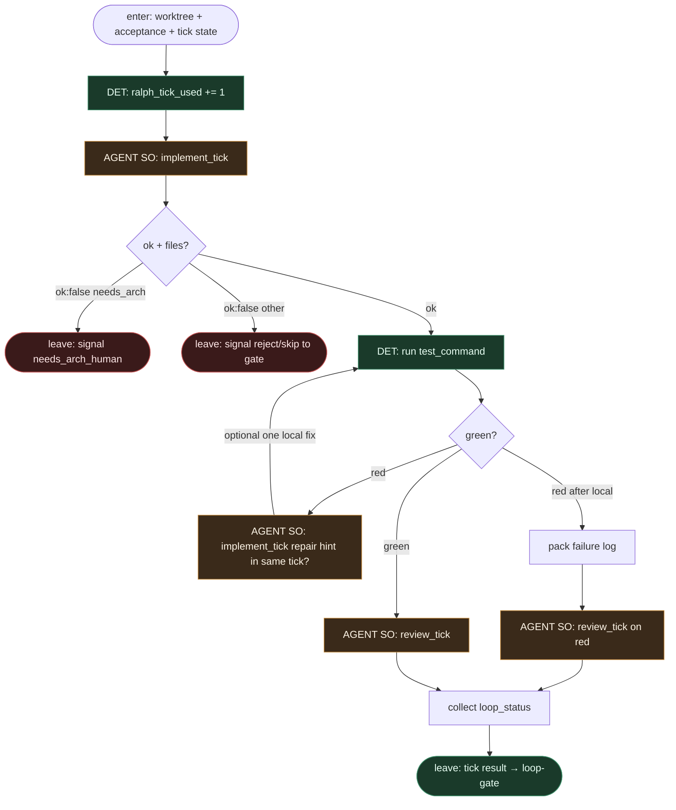

# Subgraph: ralph-tick

**Theme:** jedno przejście **implement → review** (ciało pętli Ralph).  
**Mode mix:** AGENT SO ×2 (osobne role) + DET bump licznika / lokalny test. **Bez** git push/PR w środku ticka.

## Flow



## Notes

- **Tick = para ról, nie monolit.** `implement_tick` i `review_tick` to osobne liście SO. Ten sam model w obu siedzeniach jest OK organizacyjnie, ale **kontrakt roli** jest rozdzielony (reviewer ≠ stempel implementera).
- **Licznik DET przed pracą.** Bump na wejściu ticka — agent nie „prosi o darmowy tick”.
- **Lokalny test jest wyrocznią postępu**, nie zastępuje `loop_status`. Zielony ≠ `LOOP_COMPLETE`; complete ogłasza tylko review względem acceptance.
- **Ceiling kodera w ticku = working tree.** Żadnego `git push` / `gh pr create` tutaj — to `subgraph-git-pr.md` po bramce.
- **Czerwony lokalny.** Review nadal dostaje log (żeby ustawić `continue` z powodami albo `reject`); nie otwieramy PR na czerwono później.
- **Handoff.** `{tick, implement_so, test_green, review_so{verdict, loop_status, reasons, risk, arch_flags}}`.

## Structured output

### implement_tick

```json
{
  "ok": true,
  "tick": 2,
  "summary": "wire handler + test",
  "files_touched": ["src/x.ts", "src/x.test.ts"],
  "tests_run_locally": true,
  "acceptance_progress": ["done: handler returns 200", "todo: error path"]
}
```

### review_tick

```json
{
  "verdict": "approve_progress",
  "loop_status": "continue",
  "reasons": ["happy path ok; missing 404 case from acceptance"],
  "risk": "low",
  "arch_flags": []
}
```

`loop_status` ∈ `continue` | `LOOP_COMPLETE` | `needs_arch_human` | `reject`.
