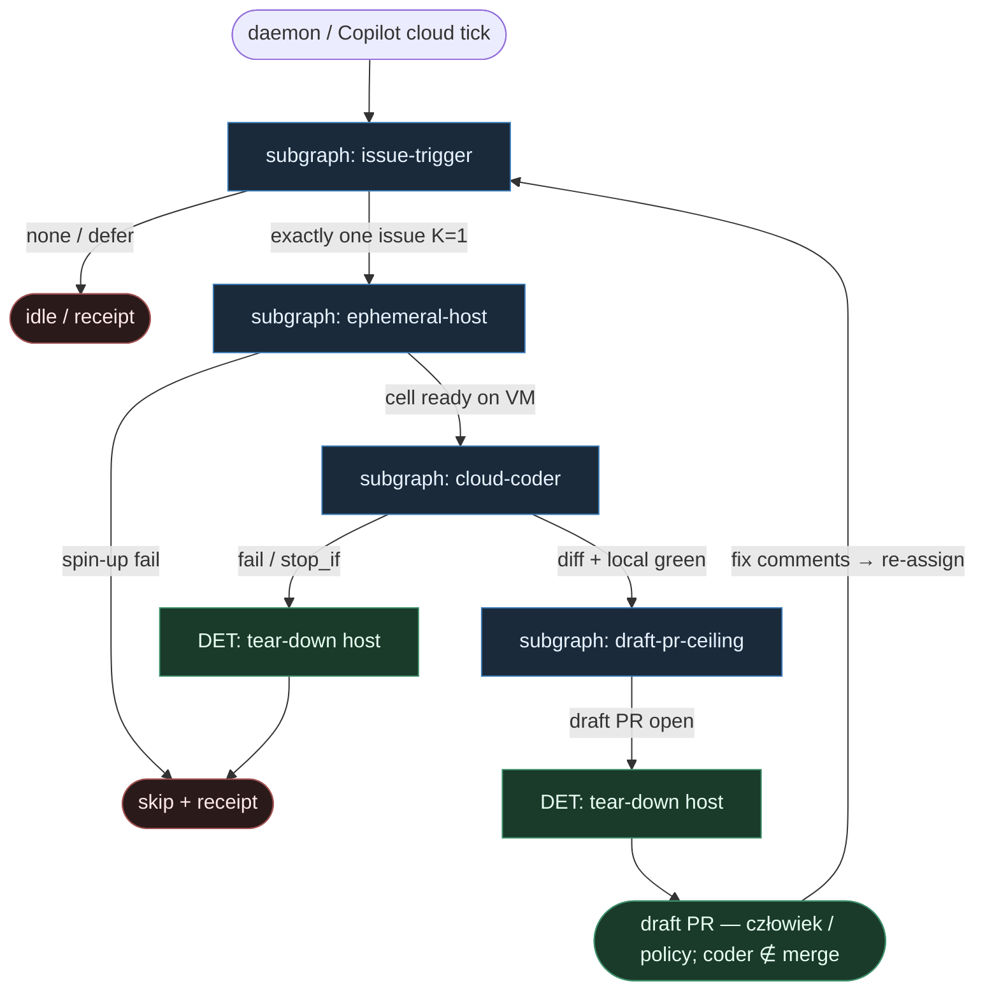

# 22 — Copilot cloud reuse

**Persona:** copilot-cloud-reuse — **issue → draft PR** na **ephemeral host**; **K=1**; **coder never merges**.

**Approach:** `reuse_ready`. Nie wymyślamy nowej pętli — bierzemy wzorce z GitHub Copilot coding agent (cloud VM) + ready-for-agent / KLEPACZ i rozkładamy na podgrafy DET-majority.

## Design notes

- **Issue / assign = start.** Trigger to etykieta `ready-for-agent` **albo** assign do Copilot (cloud agent). Zero „weź z czatu”, zero agent pick z backlogu. Inżynier pisze issue (= spec); cloud coder bierze tylko to, co oznaczono / przypisano.
- **Ephemeral host.** Jedna misja = jedna świeża maszyna (clone tip, install, branch). Brak współdzielonego dirty tree; po draft PR host **tear-down**. To odpowiednik fresh worktree z ready-for-agent, tylko poza lokalnym dyskiem.
- **K=1.** Dokładnie jeden ticket → jeden host → jeden **draft** PR. Live occupancy na ephemeral slot = defer kolejnego labeled/assigned.
- **Coder ceiling = draft PR.** Cloud coder kończy na otwartym **draft** PR (`Closes #N`). **Nigdy** nie merguje. Merge = człowiek albo DET Merge Policy Off|Classify|Always poza tym wariantem (domyślnie Off).
- **DET majority.** List/filter/claim, spin-up host, clone, install, test, commit, push, open draft PR, CI wait, tear-down — skrypty. AGENT tylko w liściu implement (+ opc. thin plan / review SO) na hoście.
- **Meat ≡ AI.** To samo siedzenie AGENT: usługa mięsa albo Copilot cloud — graf i kontrakt SO bez zmian.
- **Subgrafy, nie monolit.** issue-trigger · ephemeral-host · cloud-coder · draft-pr-ceiling.
- **NOT L5.** Zdejmujemy babysitting issue→draft PR na chmurze. Nie lights-out bank, nie „wyrzuć inżyniera / PO / UX / QA”.
- **Cel ludzki (SOUL):** człowiek ma energię na architekturę i niewygodne pytania — bo nie spalił dnia na ticket→VM→branch→push→otwórz PR.
- **Kryterium:** draft `ai/…` PR na tipie hosta (albo świadomy skip) — nie ładny JSON bez skutku i nie merged-by-coder.

## Top-level flowchart

**DET vs AGENT at a glance**

| Layer | Mode | Skąd (reuse) | Uwaga |
|-------|------|--------------|-------|
| Label / assign pick | DET | Copilot assign + ready-for-agent label | tylko marked; agent nie wybiera |
| Ephemeral host spin-up + clone + install | DET | Copilot cloud VM / fresh sandbox | K=1 occupancy; tear-down after |
| Implement (+ opc. plan/review) | AGENT leaf SO | Copilot coding agent on host | structured output; fail = ok:false |
| Commit / push / open **draft** PR | DET | harness / gh | `draft:true`, `Closes #N` |
| CI wait | DET | GitHub checks | fail-closed na merge path; draft może czekać |
| Merge Off\|Classify\|Always | DET policy / human | ready-for-agent Merge Policy | **coder never merges** |

## Index of subgraphs

| File | Theme | Role in chain |
|------|--------|----------------|
| [subgraph-issue-trigger.md](./subgraph-issue-trigger.md) | label / assign = start | DET intake; K=1 claim |
| [subgraph-ephemeral-host.md](./subgraph-ephemeral-host.md) | spin-up → clone → install | DET cloud cell; tear-down contract |
| [subgraph-cloud-coder.md](./subgraph-cloud-coder.md) | implement SO on VM | jedyny AGENT entropy sink |
| [subgraph-draft-pr-ceiling.md](./subgraph-draft-pr-ceiling.md) | draft PR + coder ≠ merge | DET ceiling; merge poza coderem |

## Mapowanie na kanon KLEPACZ / SOUL / Copilot cloud

| Pewniaczek | Tu |
|------------|----|
| Label = start | subgraph-issue-trigger (label **lub** assign:copilot) |
| Jeden ticket / jeden sandbox / K=1 | subgraph-ephemeral-host (1 VM) |
| Coder ≠ merge | draft-pr-ceiling; merge = human/policy |
| Fresh sandbox | ephemeral host zamiast lokalnego worktree |
| Structured output wszędzie LLM | cloud-coder kontrakty |
| Merge Off/Classify/Always | poza ceiling (domyślnie Off — draft czeka) |

## Antyteza (czego tu nie ma)

- Agent wybierający pracę z czatu / unlabeled backlogu
- Trwały shared runner z dirty tree
- Cloud coder z uprawnieniem merge / squash
- K>1 równoległych hostów na to samo repo mid-flight
- L5 lights-out / wymyślanie ticketów
- Monolityczny fat graf z merge w środku implementera
