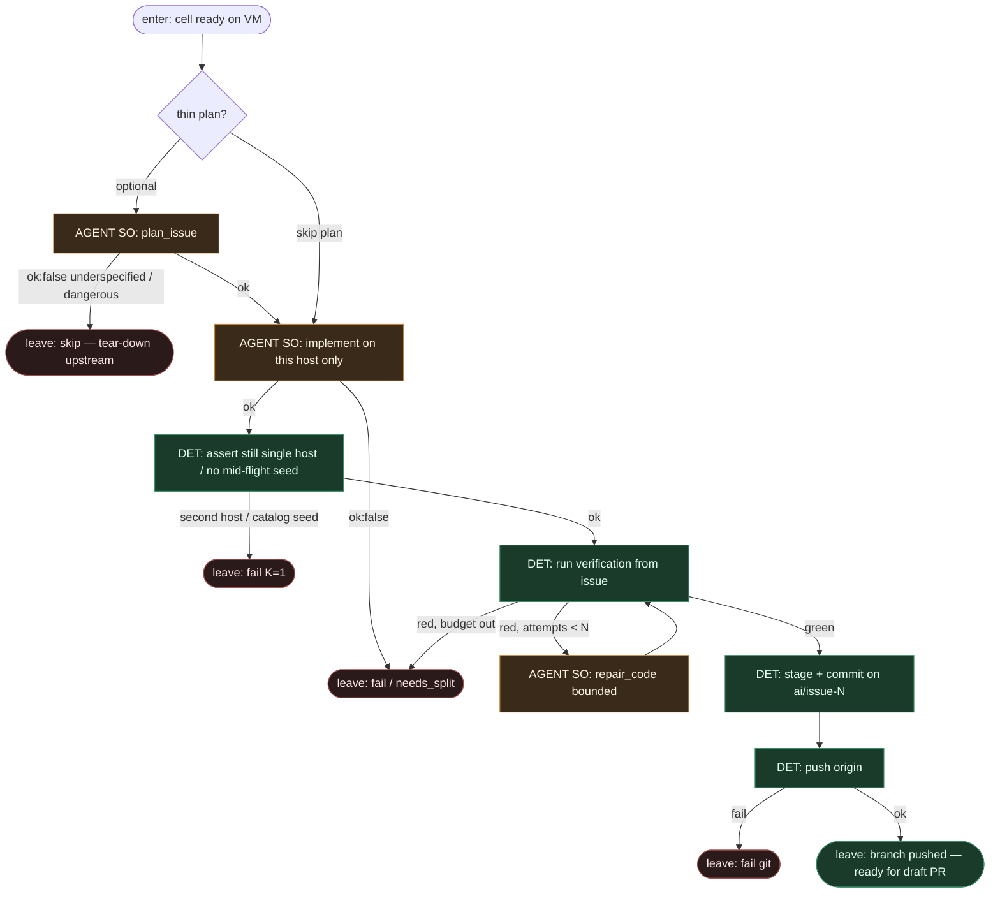

# Subgraph: cloud-coder

**Theme:** Copilot / headless agent jako **liść** na ephemeral host — implement (+ opc. thin plan); meat ≡ AI.  
**Mode mix:** AGENT SO tylko w liściach; test/commit lokalne na VM = DET.  
**Handoff in:** cell ready on VM.  
**Handoff out:** `{branch, commit_shas, summary}` → draft-pr-ceiling, albo `{skip|fail, reason}` → tear-down.

## Flow

## AGENT leaves (structured output)

| Leaf | Schema (ok) | Schema (fail) |
|------|-------------|-----------------|
| `plan_issue` *(opc.)* | `{ok, goal, files, test_command, non_goals, stop_if}` | `{ok:false, reason: underspecified\|too_large\|dangerous}` |
| `implement` | `{ok, summary, files_touched, tests_run}` | `{ok:false, reason: cant_comply\|needs_split\|blocked_path}` |
| `repair_code` | same as implement | budget / same fail enums |

## Notes

- **Reuse fidelity.** Copilot coding agent siedzi na ephemeral VM i klepie diff; ready-for-agent: headless leaf w worktree. Tu liść **kończy na pushed branch** — open draft PR to osobny DET ceiling.
- **Liść, nie orkiestrator.** Agent dostaje SO schema; nie routuje factory_pass, nie pickuje sąsiada, nie merguje.
- **Głupi i posłuszny.** Trzymaj się issue: In scope / Out / Ask-or-stop (auth, billing, migracje, deps). Inteligentny „ulepszacz” = ryzyko (KLEPACZ).
- **Bounded repair.** max N na `repair_code`; potem skip + evidence — nie wieczne limbo na płatnym hoście.
- **No mid-flight seed.** Zakaz drugiego hosta / drugiego ticketa / „przy okazji #N+1”.
- **Coder ceiling jeszcze nie tu.** Merge i nawet open-PR żyją w `draft-pr-ceiling` — ten subgraph tylko pushuje branch.
