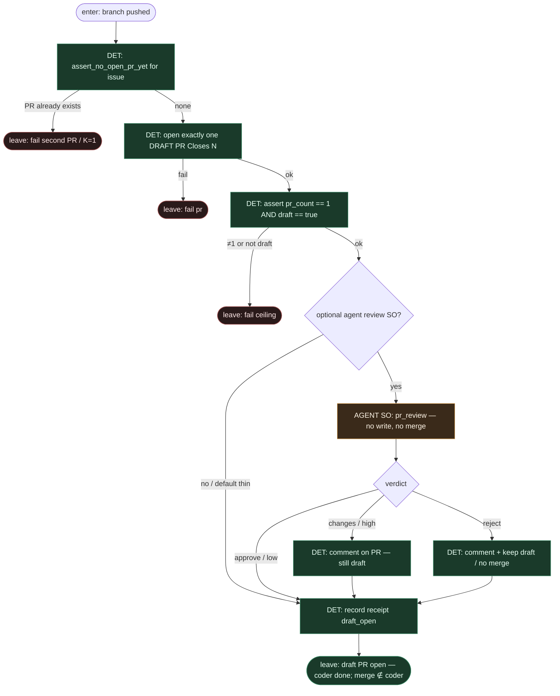

# Subgraph: draft-pr-ceiling

**Theme:** otwórz **dokładnie jeden draft PR** — to sufit coderа; **coder never merges**.  
**Mode mix:** 100% DET (opc. AGENT SO review bez write).  
**Handoff in:** branch pushed on origin.  
**Handoff out:** `{ok:true, pr_url, draft:true, closes: N}` → tear-down host; merge = human/policy poza tym wariantem.

## Flow

## DET atoms

| Atom | ok means | fail |
|------|----------|------|
| `assert_no_open_pr_yet` | 0 open PR dla issue | `pr_already_open` |
| `open_draft_pr_closes_n` | 1 PR, `draft:true`, body `Closes #N` | `pr_failed` |
| `assert_draft_ceiling` | count=1 ∧ draft | `k1_pr_violation` / `not_draft` |
| `record_receipt` | evidence path + pr_url | — |

## Merge authority (poza coderem)

| Policy | Kto merguje | Cloud coder |
|--------|-------------|-------------|
| **Off** (default) | człowiek po review | **never** |
| Classify | DET + opc. classify SO → low only | **never** |
| Always | DET po zielonym CI (wąski allowlist) | **never** |

## Notes

- **Coder ceiling = draft PR.** To kanon wariantu: issue→**draft** PR na ephemeral host. Ready-for-agent „open PR”; tu dodatkowo **draft**, żeby merge button nie był w zasięgu cloud coderа.
- **Coder never merges.** Żaden liść AGENT w tym wariancie nie ma `gh pr merge` / squash / auto-merge. Review SO = werdykt + komentarz, zero write do tipu.
- **K=1 PR.** Drugi open PR na ten sam ticket = fail closed.
- **Po leave:** top-level **tear-down** ephemeral host. Artefakt = remote branch + draft PR.
- **NOT L5.** Draft czeka na człowieka (Off) albo na DET policy — nie lights-out merge przez model.
