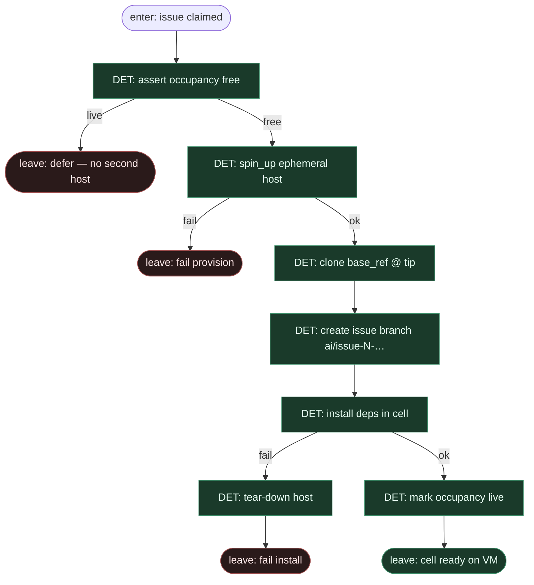

# Subgraph: ephemeral-host

**Theme:** spin-up świeżej maszyny chmurowej → clone tip → install — odpowiednik fresh worktree, poza lokalnym dyskiem.  
**Mode mix:** 100% DET.  
**Handoff in:** claimed issue payload.  
**Handoff out:** `{host_id, workdir, base_sha, branch}` albo `{fail, reason}` + zawsze tear-down path.

## Flow

## DET atoms

| Atom | ok means | fail |
|------|----------|------|
| `assert_occupancy_free` | 0 live ephemeral missions | `defer` / `k1_violation` |
| `spin_up_host` | VM/session id + SSH/API handle | `provision_failed` |
| `clone_tip` | clean workdir @ `base_sha` | `clone_failed` |
| `branch_ai_issue` | `ai/issue-N-…` from tip | `git_failed` |
| `install_deps` | lockfile install exit 0 | `install_failed` |
| `mark_live` | occupancy = live | — |
| `tear_down_host` | VM gone; no dirty residue | best-effort; always attempted on fail path |

## Notes

- **Reuse fidelity.** ready-for-agent: fresh worktree + install. Copilot cloud: ephemeral runner. Tu ten sam kontrakt komórki — **jeden host na ticket**, zero shared dirty tree.
- **K=1 occupancy.** Drugi spin-up mid-flight = fail closed / defer. Serial, nie parallel fan-out.
- **Tear-down contract.** Każda ścieżka fail **oraz** happy path po draft PR (top-level) woła `tear_down_host`. Persistence = tylko remote branch + draft PR.
- **Brak lokalnego worktree.** Box użytkownika nie jest sandboxem; cloud cell jest efemeryczna.
- **Meat ≡ AI.** Ten sam DET spine niezależnie kto później siedzi w liściu AGENT.
