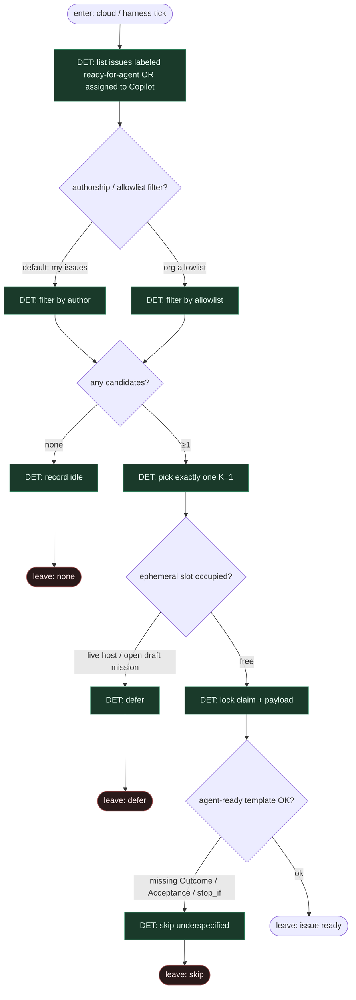

# Subgraph: issue-trigger

**Theme:** etykieta `ready-for-agent` **lub** assign do Copilot = jedyny start (reuse Copilot cloud + ready-for-agent).  
**Mode mix:** 100% DET. Agent nie wybiera pracy.  
**Handoff in:** daemon / Copilot cloud tick.  
**Handoff out:** `{issue_id, title, body, labels, assignees, base_ref, claim_token}` albo `{none|defer}`.

## Flow

## Notes

- **Reuse fidelity.** Copilot coding agent startuje od assign/issue; ready-for-agent od label. Tu **OR** — ta sama DET lista, zero triage AGENT.
- **Label/assign ≠ chat.** Człowiek projektuje issue; klepacz/cloud startuje od markera. Nie „wygląda na gotowe”.
- **K=1.** Jedna misja naraz per repo/ephemeral occupancy; reszta czeka w kolejce marked.
- **Fail closed.** Brak kandydatów → idle. Underspecified template → skip + receipt, nie „lepszy model zgadnie”.
- **Agent-ready gate (DET).** Twardy check szablonu (Outcome / In-Out / Acceptance / Allowed / Ask-or-stop / Verification) — taniej niż retry na VM.
