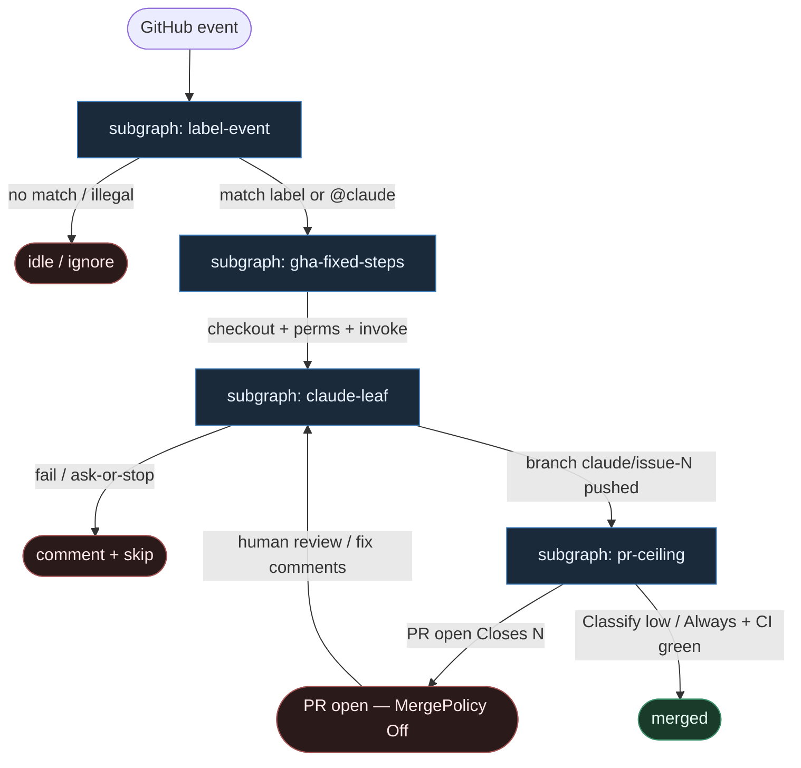

# 23 — Claude Code Action reuse

**Persona:** `claude-action-reuse` — maksymalna wierność [anthropics/claude-code-action](https://github.com/anthropics/claude-code-action): **label/event → fixed GHA steps → `claude/issue-N` → PR**. Agenty są **liśćmi**.

**Approach:** `reuse_ready`. Nie wymyślamy nowego orkiestratora — bierzemy oficjalny Claude Code Action w GitHub Actions i rozkładamy go na podgrafy DET-majority zgodne z SOUL / KLEPACZ.

## Design notes

- **Label / event = start.** `issues.labeled` (np. `ready-for-agent` / `claude` / `do`), `issue_comment` z `@claude`, albo `workflow_dispatch`. Zero agent pick z czatu / backlogu.
- **Fixed GHA steps = spine.** YAML workflow jest programem: `checkout` → permissions → `anthropics/claude-code-action@v1` → (opc.) open PR. Kolejność stała; LLM nie routuje jobów.
- **Claude Code Action = liść.** Entropy tylko wewnątrz action (implement / Q&A / review). Action nie wybiera następnego węzła grafu — kończy się artefaktem (branch / comment / fail).
- **Branch `claude/issue-N`.** Konwencja reuse: jedna misja = jeden branch nazwany po issue. K=1 occupancy per ticket.
- **Coder ceiling = open PR.** Action + GHA dochodzą do PR `Closes #N`. Merge = polityka DET / człowiek (domyślnie **Off**).
- **DET majority.** Trigger parse, `if:` guard, checkout, secrets wiring, branch push plumbing, PR create, CI wait — skrypty / GHA. AGENT tylko w liściu action.
- **Meat ≡ AI.** To samo siedzenie w łańcuchu; graf się nie zmienia gdy liść wypełnia człowiek-klepacz vs model.
- **NOT L5.** Zdejmujemy babysitting issue→PR w CI runnerze. Nie lights-out bank, nie „wyrzuć inżyniera”.
- **Cel (SOUL):** człowiek ma energię na architekturę — bo nie spalił dnia na ticket→branch→push→PR.

## Top-level flowchart

**DET vs AGENT at a glance**

| Layer | Mode | Skąd (reuse) | Uwaga |
|-------|------|--------------|-------|
| Label / `@claude` / dispatch | DET | GHA `on:` + `if:` | agent nie wybiera pracy |
| checkout, perms, secrets | DET | fixed workflow YAML | spine bez LLM |
| `claude-code-action@v1` | AGENT leaf | anthropics action | entropy tylko tu |
| branch `claude/issue-N` | DET convention | action + gh | K=1 per issue |
| open PR `Closes #N` | DET | gh / action follow-up | coder ≠ merge |
| Merge Off\|Classify\|Always | DET policy | KLEPACZ / ready-for-agent | default Off |

## Index of subgraphs

| File | Theme | Role in chain |
|------|--------|----------------|
| [subgraph-label-event.md](./subgraph-label-event.md) | label / @claude / event | DET trigger gate |
| [subgraph-gha-fixed-steps.md](./subgraph-gha-fixed-steps.md) | fixed GHA YAML spine | DET checkout→invoke |
| [subgraph-claude-leaf.md](./subgraph-claude-leaf.md) | Claude Code Action leaf | jedyny AGENT entropy sink |
| [subgraph-pr-ceiling.md](./subgraph-pr-ceiling.md) | PR + merge policy | coder ceiling; merge DET/human |

## Mapowanie Claude Code Action → klepacz

| Claude Action / GHA | Klepacz seat |
|---------------------|--------------|
| `on: issues.labeled` / `issue_comment` | subgraph-label-event |
| job `steps:` checkout + action | subgraph-gha-fixed-steps |
| `anthropics/claude-code-action@v1` | subgraph-claude-leaf (AGENT) |
| branch `claude/issue-N` | leaf output → DET convention |
| open PR referencing issue | subgraph-pr-ceiling |
| human merge / policy | MergePolicy Off (default) |
| agent as workflow router | **FORBIDDEN** |

## Antyteza (czego tu nie ma)

- Agent wybierający pracę z czatu / unlabeled backlogu
- LLM routujący kolejne joby GHA („co dalej w YAML”)
- Monolit: merge wewnątrz action jako jedyna ścieżka
- L5 lights-out / wymyślanie ticketów
- Współdzielony dirty tree poza runnerem (runner = świeża komórka)

## Kryterium sukcesu

Technicznie: branch `claude/issue-N` + otwarty (opc. zmergowany) PR na tipie hosta. Ludzko: inżynier nie babysittował issue→PR — energia na architekturę i niewygodne pytania QA.
