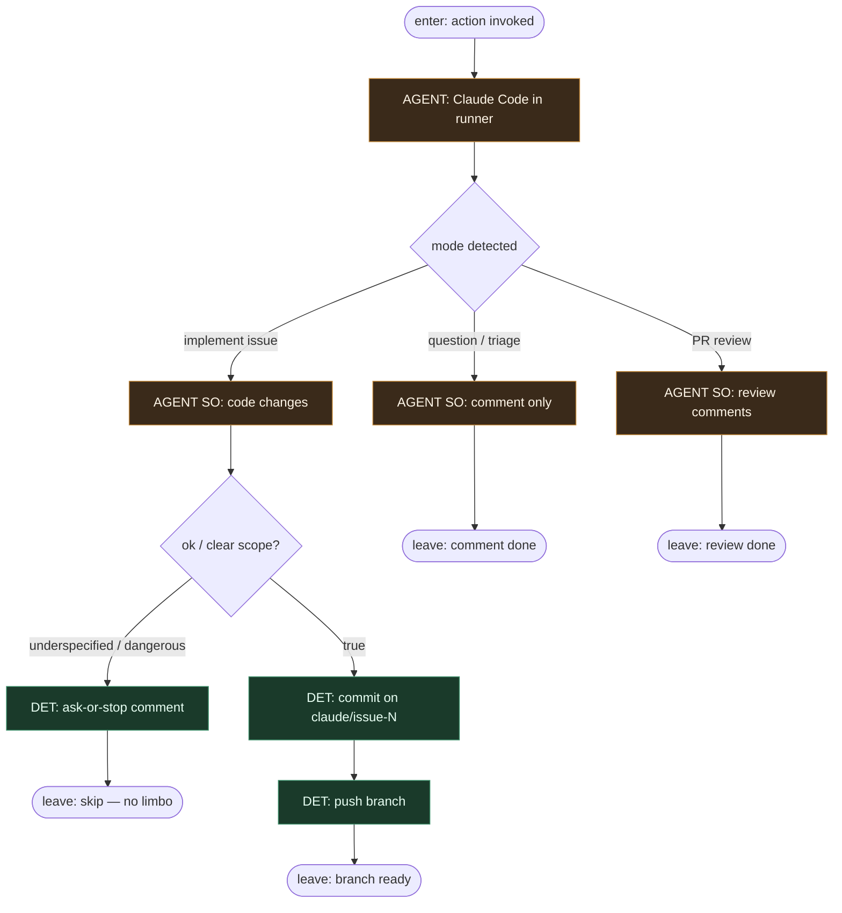

# Subgraph: claude-leaf

**Theme:** `anthropics/claude-code-action` jako **liść AGENT** — implement / Q&A / review; nie orkiestrator.  
**Mode mix:** AGENT tylko w action; branch name + stop = DET konwencja.

## Flow

## Notes

- **Reuse fidelity.** Action inteligentnie wybiera *tryb wykonania* (interactive / automation) z kontekstu workflow — to nadal **liść**: nie flipuje stage-labeli fabryki ani merge policy.
- **Branch `claude/issue-N`.** Stała konwencja nazwy; jeden ticket → jeden branch. Occupancy DET przed invoke.
- **Liść, nie orkiestrator.** Claude nie decyduje „uruchom następny workflow” ani „zmień MergePolicy”. Wynik = diff + branch / komentarz / fail.
- **Ask-or-stop.** Auth, billing, migracje, deps poza Allowed → comment + stop (KLEPACZ), nie „ulepsz po drodze”.
- **Meat ≡ AI.** To samo siedzenie: headless Claude w action albo człowiek-klepacz w tym samym runner contract — graf bez zmian.
- **Bounded.** `claude_args` (`--max-turns`, allowedTools) = budżet DET wokół liścia; wyczerpanie → skip + evidence.
- **Handoff contract.** `{branch: claude/issue-N, shas[], summary}` \| `{comment_only}` \| `{skip, reason}`.
