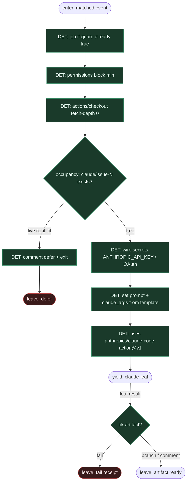

# Subgraph: gha-fixed-steps

**Theme:** stały YAML GHA = deterministyczny kręgosłup; kroki nie są wybierane przez LLM.  
**Mode mix:** 100% DET. Claude Action jest *wywoływany*, nie orkiestruje jobów.

## Flow

## Fixed step table (compose)

| # | Step | Who | Notes |
|---|------|-----|-------|
| 1 | `if:` label / `@claude` | DET | już z label-event |
| 2 | `permissions:` least privilege | DET | contents/PRs/issues write tylko gdy issue→PR |
| 3 | `actions/checkout@v4` | DET | świeża komórka runnera = worktree |
| 4 | secret / OIDC wire | DET | never in prompt body |
| 5 | `claude-code-action@v1` | invoke leaf | prompt template stały |
| 6 | post: receipt / defer comment | DET | fail closed |

## Notes

- **YAML is the program.** Kolejność kroków jest stała — jak Temporal Workflow body / label-FSM spine. Model nie dopisuje `steps:`.
- **Runner = fresh cell.** Efekt fresh worktree z ready-for-agent: czysty checkout per run, K=1 na ticket.
- **Prompt = template, nie router.** `prompt:` / `claude_args:` są wypełniane z issue payload; nie „zdecyduj co robić w fabryce”.
- **Permissions cynic.** Review-only → read + PR write. Issue→PR → contents + pull-requests write. Bez zbędnego `id-token` jeśli nie Bedrock/Vertex.
- **Handoff.** Yield claude-leaf = `{issue_id, workspace, prompt_ref, branch_target: claude/issue-N}`.
