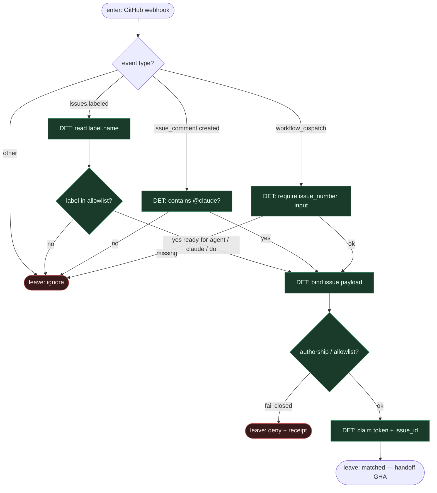

# Subgraph: label-event

**Theme:** etykieta / `@claude` / event = jedyny start (reuse Claude Code Action triggers).  
**Mode mix:** 100% DET. Agent nie wybiera pracy.

## Flow

## Notes

- **Reuse fidelity.** Claude Code Action aktywuje się z kontekstu workflow: label, mention `@claude`, assignment, albo explicit `prompt` w automation mode — nie z „agent przeszukał backlog”.
- **Allowlist etykiet.** Typowo `ready-for-agent` (KLEPACZ) albo `claude` / `do` (plan-then-do). Poza listą = ignore.
- **Fail closed.** Brak matcha → idle. Nie wymyślaj ticketów, nie bierz unlabeled „bo wygląda na gotowe”.
- **K=1 hint.** Handoff niesie jeden `issue_id`; occupancy (otwarty `claude/issue-N` / live run) może zablokować claim w następnym podgrafie.
- **Handoff contract.** Output = `{issue_id, title, body, labels, trigger, actor}` albo `{ignore|deny}`.
