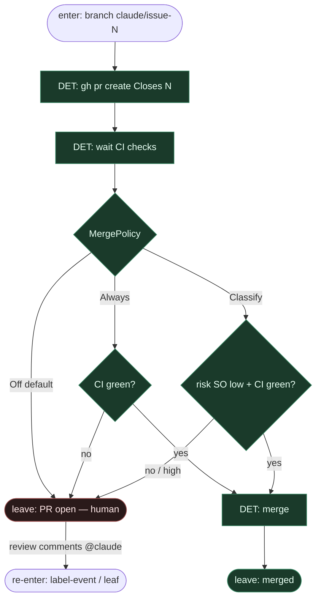

# Subgraph: pr-ceiling

**Theme:** coder ceiling = otwarty PR; merge zostaje przy DET policy / człowieku.  
**Mode mix:** DET open PR + policy; zero LLM-merge.

## Flow

## Notes

- **Coder ≠ merge.** Claude Code Action (i GHA) kończą na PR. Gałka Off\|Classify\|Always jak w ready-for-agent; start **Off**.
- **Closes #N.** DET body PR linkuje issue; branch już `claude/issue-N`.
- **Classify SO (opc.).** Tylko gdy policy=Classify; advisory risk, nie autoryzacja sama w sobie. Off/Always → zero classify LLM.
- **Fail closed na czerwonym CI.** Always bez zielonego CI = hold.
- **Fix loop.** Komentarz / re-label / `@claude` wraca do label-event → GHA → leaf; nie merge z liścia.
- **NOT L5.** PR open przy Off = sukces klepacza; człowiek / QA trzyma merge i niewygodne pytania.
- **Handoff.** `{pr_url, number, policy_verdict: hold|merged}`.
