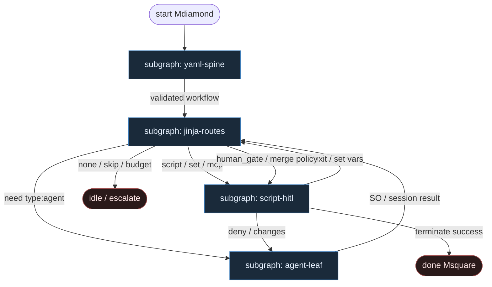

# 24 — Conductor YAML (Microsoft Conductor)

**Persona:** conductor-yaml compose — Microsoft Conductor: workflow w YAML; routing przez Jinja = **0 tokenów** orkiestracji; LLM wyłącznie w krokach `type: agent` (liść).

**Approach:** compose. Mapowanie [microsoft/conductor](https://github.com/microsoft/conductor) (WAVE3 §6 / instance `microsoft-conductor`, conf 92) na duszę klepacza (ticket→PR, nie L5). **Nie** artushin/conductor-ai (Rust/tmux).

## Design notes

- **Orkiestracja = 0 tokenów.** Ciało workflow + warunki `route` (Jinja) + `set` / `script` / `mcp` / `terminate` / `human_gate` — zero wywołań modelu. Routing to wyrażenie, nie „agent wybiera co dalej”.
- **YAML jest programem.** `conductor run ticket-to-pr.yaml` — wersjonowane w PR, te same lokalnie i w CI. Zmiana procesu = edycja YAML + review, nie chat-loop.
- **Jinja: first matching condition wins.** Diamenty DET (`` / `needs_code` / `clarify`) wybierają następną krawędź deterministycznie.
- **`type: agent` tylko jako liść.** Plan / implement / review / bounded-fix — izolowane sesje (Copilot SDK / Anthropic). Model wypełnia SO; nie routuje, nie woła `terminate`, nie trzyma merge.
- **Agent-free steps.** `script` (pytest, gh, git), `set` (stan bez LLM), `mcp` bez modelu, `human_gate`, `terminate` — mięso≡AI w tym samym slocie *agent*, ale plumbing jest skryptem.
- **Jeden ticket, jeden PR.** K=1; occupancy/worktree = `script` przed liściem implement.
- **NOT L5.** Cel: zdjąć wyczerpujące klepanie; merge zostaje przy polityce / `human_gate`.

## Top-level flowchart

**DET vs AGENT at a glance**

| Layer | Mode | Responsibility |
|-------|------|----------------|
| YAML load + schema validate | DET | Parse workflow; reject unknown step types |
| Jinja `route` conditions | DET | First-match next step; **0 tokens** |
| `script` / `set` / `mcp` / `terminate` | DET | pick, worktree, test, git, open_pr, merge_policy |
| `type: agent` | AGENT leaf | plan / implement / review / bounded-fix — isolated session |
| `human_gate` | HITL | MergePolicy Off / clarify — nie LLM judge |
| LLM as graph router | — | **FORBIDDEN** — Jinja owns next step |

## Index of subgraphs

| File | Theme | Role in chain |
|------|--------|----------------|
| [subgraph-yaml-spine.md](./subgraph-yaml-spine.md) | Load + validate `*.yaml` workflow | DET front: YAML-is-code |
| [subgraph-jinja-routes.md](./subgraph-jinja-routes.md) | Jinja route / first-match | 0-token orchestration spine |
| [subgraph-agent-leaf.md](./subgraph-agent-leaf.md) | `type: agent` leaves only | Entropy slot; not router |
| [subgraph-script-hitl.md](./subgraph-script-hitl.md) | `script`/`set`/`mcp` + `human_gate` | DET plumbing + HITL → terminate |

## Compose map (MS Conductor → klepacz)

| Conductor concept | Klepacz seat |
|-------------------|--------------|
| `conductor run workflow.yaml` | daemon tick / GHA: labeled issue → one run |
| YAML step graph | fixed FSM ticket→PR (nie department brain) |
| Jinja `route` (first match) | DET diamonds: tests_ok, occupancy, clarify, budget |
| `type: agent` | plan_issue / implement / pr_review / repair SO leaves |
| `script` | pick_one_labeled, worktree, pytest, commit, push, open_pr |
| `set` | bind ticket_id, attempt, policy vars — bez modelu |
| `human_gate` | MergePolicy Off / high-risk hold |
| `terminate` | done / escalate — nie LLM verdict jako jedyny koniec |
| LLM in route expression | **FORBIDDEN** |
| artushin/conductor-ai | **out of scope** (inny produkt) |

## Kryterium sukcesu

Człowiek ma energię na architekturę i niewygodne pytania — bo routing i git/PR nie spalają tokenów ani dnia. Technicznie: `conductor run` przechodzi YAML do otwartego (i opcjonalnie zmergowanego) `ai/fix`; Jinja wybiera następny krok; `type: agent` nigdy nie jest routerem.
