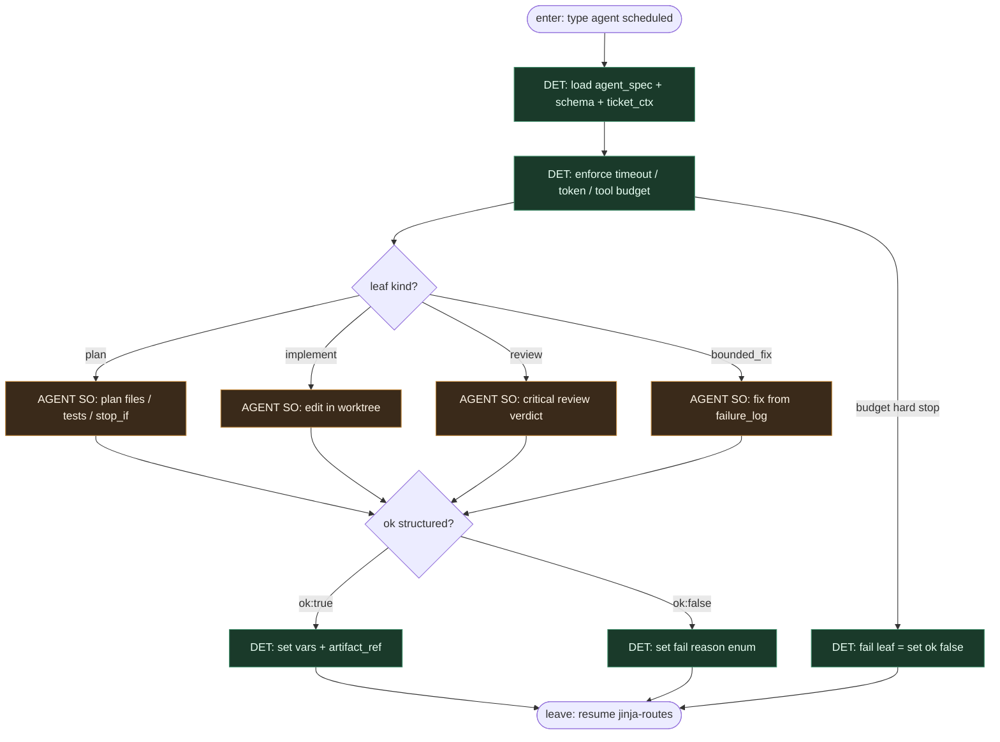

# Subgraph: agent-leaf

**Theme:** `type: agent` — **jedyny** slot LLM; liść z izolowaną sesją; nie router.  
**Mode mix:** AGENT leaf only. Jinja/YAML decydują *kiedy*; sesja wypełnia SO.

## Flow

## Notes

- **Leaf, not brain.** Model nie ewaluuje Jinja, nie wybiera `terminate`, nie przestawia label FSM, nie merge’uje.
- **Isolated sessions.** Plan / implement / review / fix = osobne kroki `type: agent` (osobne sesje Conductor). Reviewer ≠ implementer nawet przy tym samym vendorze.
- **Structured output.** `ok:true` + artefakt albo `ok:false` + reason enum → `set` do vars → z powrotem do jinja-routes.
- **Meat ≡ AI.** Ten sam `type: agent` seat; silnik nie rozróżnia kto wypełnił SO.
- **Handoff contract.** Leave = `{step_id, ok, artifact_ref, reason?, usage}` → vars dla następnego first-match.
