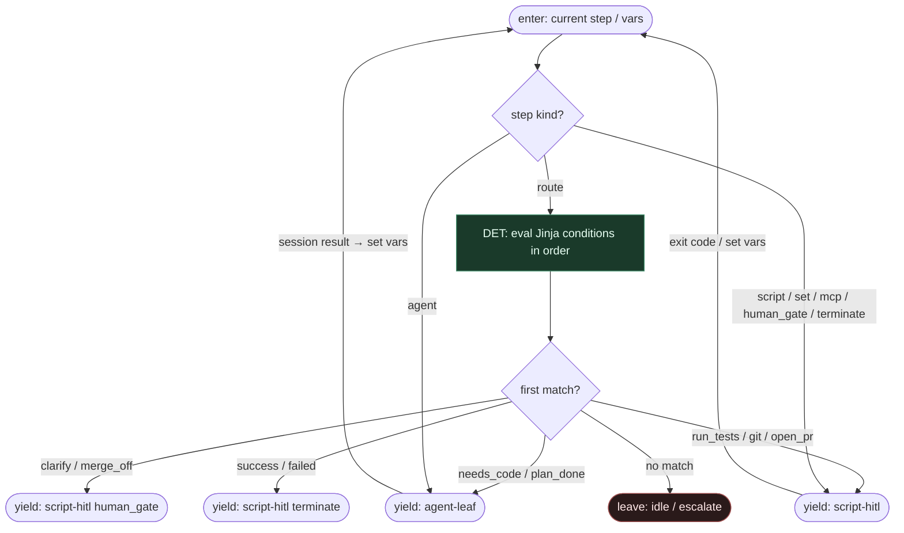

# Subgraph: jinja-routes

**Theme:** Orkiestracja = wyrażenia Jinja; **0 tokenów**; first matching condition wins.  
**Mode mix:** DET only. Model nie wybiera następnego kroku.

## Flow

## Notes

- **0-token orchestration.** Eval Jinja na `vars` (wyniki `script`, SO z liści, `set`) — bez promptu, bez tool-call routera.
- **First match wins.** Kolejność warunków w YAML = priorytet (np. `budget_exhausted` przed `retry_fix` przed `tests_ok`).
- **Klepacz diamonds (przykłady):** `occupancy_free`, `plan_ok`, `tests_ok`, `attempt < N`, `policy == 'Always'`, `needs_clarify`.
- **Not a chat FSM.** Brak „LLM, co dalej?”. Po liściu agent wynik ląduje w `set` / vars i wraca do tego podgrafu.
- **Handoff contract.** Yield agent-leaf = `{step_id, agent_spec, prompt_ref, schema, vars_slice, attempt}`; yield script-hitl = `{step_id, kind, cmd_or_gate, vars}`.
