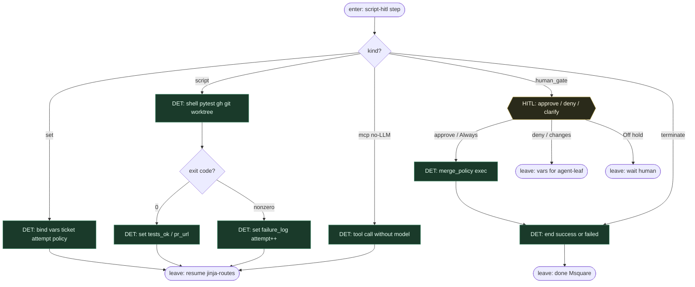

# Subgraph: script-hitl

**Theme:** `script` / `set` / `mcp` / `human_gate` / `terminate` — plumbing i HITL bez modelu.  
**Mode mix:** DET + HITL. Zero tokenów na git/test/PR/merge policy.

## Flow

## Notes

- **Script owns side effects.** pick_one_labeled, worktree, pytest, commit, push, `gh pr create` — `script`, nie agent z otwartym shelem-orkiestatorem.
- **Merge policy Off|Classify|Always** egzekwowane tu (DET + opcjonalny `human_gate`), nie werdyktem LLM jako jedyną bramką.
- **Bounded repair.** `attempt++` + Jinja `attempt < N` wraca do `type: agent` fix; wyczerpanie → `terminate failed` / escalate — nie „napraw świat”.
- **HITL = gate, nie chat-loop.** Conductor `human_gate` / dialog clarify; człowiek nie trzyma orkiestracji w RAM modelu.
- **Handoff contract.** Leave routes = zaktualizowane `vars`; leave done = `{status, pr_url?, reason?}`.
