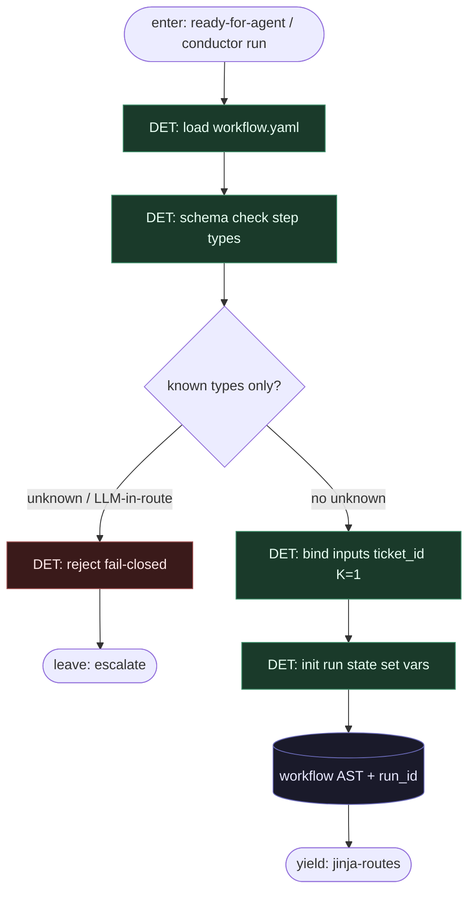

# Subgraph: yaml-spine

**Theme:** Workflow YAML = program; load + validate przed jakimkolwiek LLM.  
**Mode mix:** DET only. Zero tokenów na spine.

## Flow

## Notes

- **YAML-is-code.** Topologia żyje w pliku wersjonowanym w PR. Zmiana lane’u = diff YAML, nie „agent wymyśla pipeline”.
- **Allowed step types (klepacz subset):** `agent`, `script`, `set`, `mcp`, `route`, `human_gate`, `terminate` (+ opcjonalnie `parallel` / `for_each` / sub-workflow). Wszystko inne → reject.
- **Forbid at load time:** wyrażenie route z wywołaniem modelu; `type: agent` jako jedyny krok bez sąsiadów `script`/`route`; brak `terminate`.
- **One run per ticket.** `set` ticket_id + occupancy check zanim yield do routes; nie fan-out katalogu w środku YAML.
- **Handoff contract.** Yield jinja-routes = `{workflow_ast, run_id, vars, entry_step}`.
