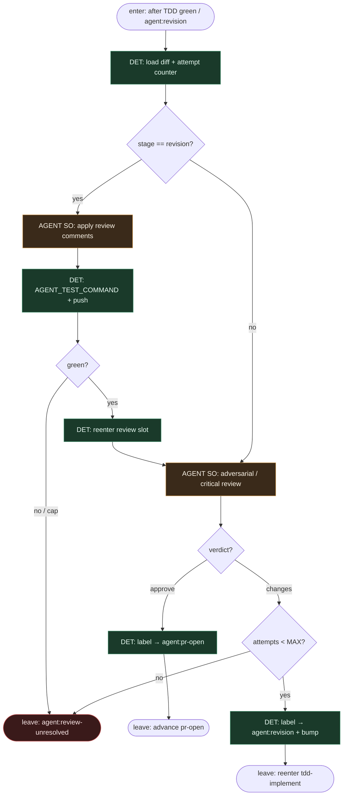

# Subgraph: adversarial-review

**Theme:** niezależny adversarial review + bounded revision przez etykiety (circuit breaker).  
**Mode mix:** AGENT SO review/fixer; DET cap, label flips, re-test.

## Flow

## Notes

- **Reviewer ≠ implementer.** Osobny dispatch profile (Claude vs Codex hybrid OK) — write limited do komentarzy / werdyktu SO. Duch jnurre „adversarial review loop”.
- **Werdykt = enum.** `{verdict: approve|changes|block, comments[]}`. DET mapuje na `agent:pr-open` / `agent:revision` / `agent:review-unresolved`. Model nie klika merge.
- **Circuit breaker.** MAX revision (np. 3) w metadata. Cap → `agent:review-unresolved` — obowiązkowy escape, nie limbo.
- **TDD też na revision.** Po fixerze znowu `AGENT_TEST_COMMAND` zanim wrócimy do review — czerwone nie wraca jako „approve z gwiazdką”.
- **Handoff:** `{verdict, attempts, pr_ready?}` → pr-cleanup albo re-enter TDD.
