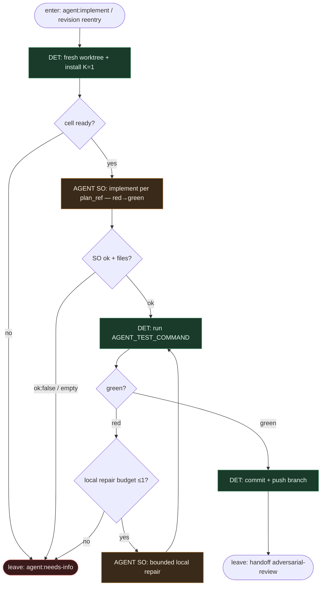

# Subgraph: tdd-implement

**Theme:** implement w fresh worktree pod TDD — `AGENT_TEST_COMMAND` jest bramką DET przed jakimkolwiek PR.  
**Mode mix:** AGENT SO implement (+ opc. 1× local repair); worktree / test / git = DET.

## Flow

## Notes

- **TDD first (jnurre).** Implementer ma pisać pod testy; **niezależnie** od intencji modelu, dispatch **zawsze** odpala `AGENT_TEST_COMMAND` jako gate. Czerwone = nie idziemy do review/PR.
- **Fresh worktree.** Self-hosted sandbox-pal: jeden ticket → jedna komórka; brak współdzielonego dirty tree. Bot PAT tylko do push/PR API.
- **Agent fills code slot only.** Structured `{ok, summary, files[], tests_touched?}`. Nie otwiera PR, nie ustawia `agent:pr-open`, nie merguje.
- **Bounded local repair.** Max 1 lokalna poprawka na czerwony test przed escape — osobno od revision cap w review (tam circuit breaker).
- **Re-entry from `agent:revision`.** Ten sam podgraf; attempt counter żyje w label/metadata issue, nie w „pamięci agenta”.
- **Handoff:** `{branch, head_sha, test_receipt}` → adversarial-review (PR może powstać tuż przed lub tuż po review — w kanonie jnurre: review loop, potem `agent:pr-open`).
