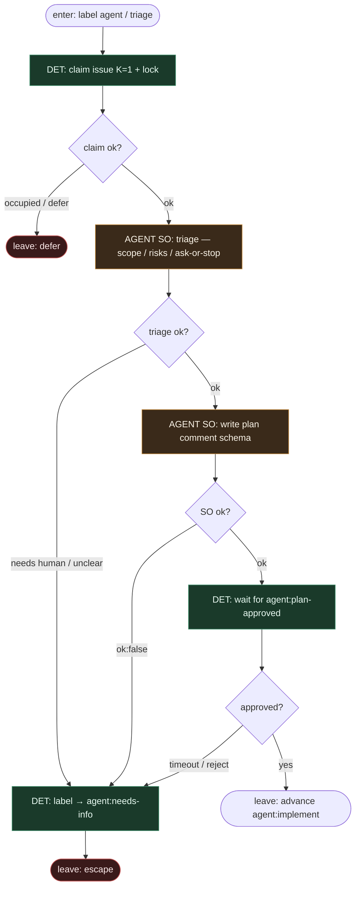

# Subgraph: triage-plan

**Theme:** triage issue + plan comment — agent wypełnia treść; approve to etykieta HITL `agent:plan-approved`.  
**Mode mix:** DET claim/flip/wait; AGENT SO triage + plan.

## Flow

## Notes

- **Slot ≠ router.** Triage SO zwraca `{ok, clarity, risks[], ask_or_stop?}`. DET mapuje `ask_or_stop` → `agent:needs-info` — agent nie wybiera kolejnego joba.
- **Plan comment = artefakt.** Schema w stylu sandbox-pal: Outcome / Steps / Files / Test command hint / Risks / Ask-or-stop. Pin lub oznaczony komentarz.
- **HITL label.** `agent:plan-approved` dokłada człowiek (lub wąska policy DET) — **nie** ten sam model, który pisał plan.
- **Fail closed.** Brak planu / `ok:false` / timeout approve → `agent:needs-info`, nie ciche „spróbuj innego modelu”.
- **Fast path (opc.).** Bardzo mały ticket: triage może zwrócić `lane=build`; DET i tak wymaga jawnego `plan-approved` albo osobnej policy „skip plan” — default = wymagaj approve (wierność jnurre).
- **Handoff:** `{issue_id, plan_ref}` → label-dispatch advance → TDD.
