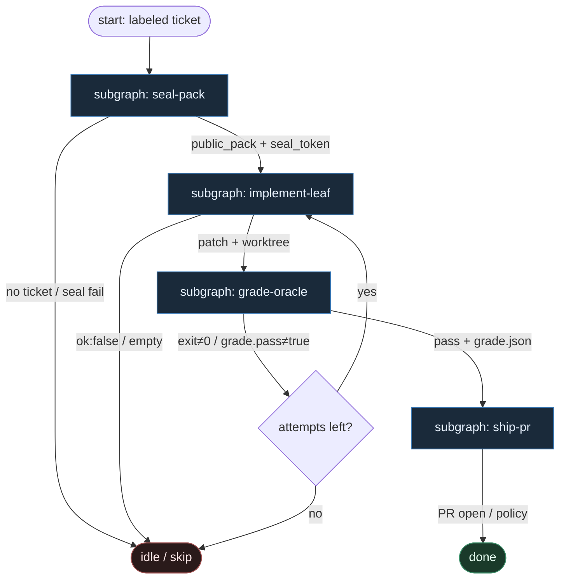

# 26 — Holdout Oracle (sealed grade)

**Persona:** `holdout-oracle compose` — **sealed holdout** ocenia patch przez **exit code + `grade.json`**, nie przez LLM-judge. Agent wypełnia **tylko** liść `implement`; routing, pieczęć testów, grade i ship = DET.

**Approach:** `compose`. Mapowanie wzorca SWE-bench / sealed private tests na duszę klepacza: ticket→PR, K=1, coder ceiling = open PR. Holdout jest niewidoczny dla modelu; public pack (issue + opc. smoke) jest jedynym kontekstem implementacji.

## Design notes

- **Seal przed implement.** DET rozdziela `public/` (widoczne) vs `holdout/` (zaplombowane). Agent **nigdy** nie dostaje holdoutu w prompcie, worktree context packu ani tool-callu.
- **Jeden slot AGENT.** Tylko `implement_leaf` SO: `{ok, summary, files[]|patch}`. Zero plan-routingu, zero self-grade, zero `gh pr`, zero flip etykiet.
- **Grade = oracle DET.** Po apply w sandboxie: runner odpala **sealed** suite → `exit_code` + maszyna-czytelny `grade.json` (`pass`, `failed[]`, `metrics`). `pass ⇔ exit_code==0 ∧ grade.pass==true`.
- **Zakaz LLM-judge.** Model nie ocenia „czy wygląda OK”, nie scoruje elegancji, nie zastępuje testów. Vibe check = fail-closed escape.
- **Public smoke ≠ oracle.** Opcjonalny szybki smoke na public fixtures może fail-fast; **autorytatywna** bramka przed ship = sealed oracle.
- **Bounded re-try.** Czerwony oracle / `ok:false` → max N wraca do implement (budżet), potem skip/escape — nie ReAct limbo.
- **Ship po zielonym grade.** Commit / push / open PR tylko gdy receipt oracle mówi pass. MergePolicy Off|Classify|Always = DET / human.
- **Meat ≡ AI.** To samo siedzenie w liściu implement; graf się nie zmienia.
- **NOT L5.** Zdejmujemy klepanie i subiektywne „LLM powiedział że OK”. Człowiek zostaje przy architekturze, QA-strategii i (gdy Off) merge.

## Top-level flowchart

**DET vs AGENT at a glance**

| Seat | Mode | Responsibility |
|------|------|----------------|
| Pick labeled + worktree | DET | Front door; K=1 |
| Split public vs holdout + seal | DET | Agent nigdy nie widzi holdout |
| Pack public context | DET | Issue + public fixtures / smoke only |
| **implement_leaf** | AGENT SO | Jedyny slot LLM — kod / patch |
| Optional public smoke | DET | Fail-fast, nie ostateczny werdykt |
| **sealed oracle run** | DET | Exit code + `grade.json` |
| Parse grade / gate | DET | `pass` rule; **no LLM-judge** |
| Commit / push / open PR | DET | Tylko po pass |
| Merge policy | DET / human | Off \| Classify \| Always |
| ReAct / self-score / judge SO | — | **FORBIDDEN** |

## Index of subgraphs

| File | Theme | Role in chain |
|------|--------|----------------|
| [subgraph-seal-pack.md](./subgraph-seal-pack.md) | split + seal holdout; public pack | Faza 1: pieczęć oracle przed agentem |
| [subgraph-implement-leaf.md](./subgraph-implement-leaf.md) | AGENT SO implement only | Faza 2: jedyny liść modelu |
| [subgraph-grade-oracle.md](./subgraph-grade-oracle.md) | apply → sealed run → exit/JSON | Faza 3: grade bez LLM-judge |
| [subgraph-ship-pr.md](./subgraph-ship-pr.md) | commit/push/PR + merge policy | Faza 4: submit po zielonym receipt |

## Compose map (holdout oracle → klepacz)

| Holdout / sealed pattern | Klepacz seat |
|--------------------------|--------------|
| Hidden private tests | DET seal holdout (`seal_token`) |
| Public fixture / prompt pack | DET `public_pack` → implement leaf |
| Model writes patch | AGENT SO `implement_leaf` only |
| Harness runs hidden suite | DET `run_sealed_oracle` |
| Pass/fail from runner | `exit_code` + `grade.json` |
| No model-as-judge | invariant `no_llm_judge` |
| Submit on pass | DET commit → push → open PR |
| Human merge when Off | MergePolicy DET / HITL |

## Antyteza (czego tu nie ma)

- LLM-judge / „ocen jakość patcha w naturalnym języku”
- Agent czytający holdout / `grade.json` przed submitem „żeby poprawić”
- ReAct tool-loop wybierający „odpalę jeszcze raz testy publiczne zamiast oracle”
- Model self-score jako bramka ship
- Fat brain: plan + implement + grade + merge w jednym prompcie
- L5 lights-out / „wyrzuć człowieka”

## Kryterium sukcesu

Człowiek ma energię na architekturę i niewygodne pytania — bo grade jest **maszynowy** (exit + JSON), a agent klepie tylko implement. Technicznie: `seal→implement→oracle(pass)→PR`; LLM nigdy nie routuje grafu ani nie zastępuje oracle.
