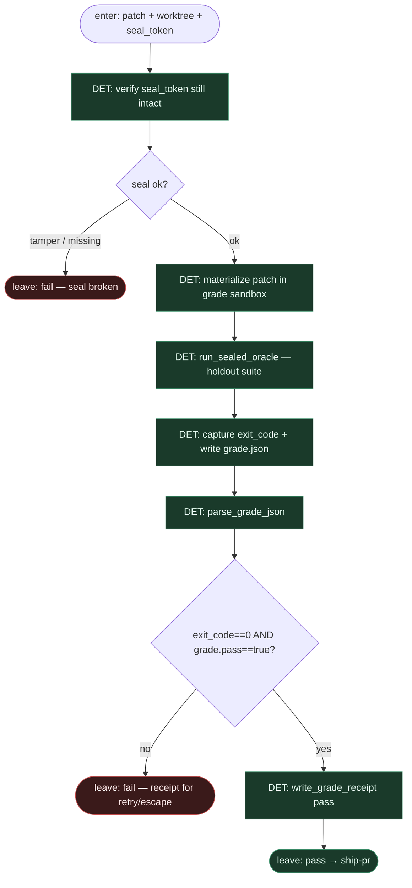

# Subgraph: grade-oracle

**Theme:** faza 3 — **sealed holdout** runner: apply → oracle → **exit code + `grade.json`**. Zero LLM-judge.  
**Mode mix:** 100% DET. Model nie uczestniczy w werdykcie.

## Flow



## Notes

- **Oracle is law.** Jedyna autorytatywna bramka przed ship. Public smoke (jeśli był) nie wystarcza.
- **Signals:** `exit_code` procesu runnera + maszyna-czytelny `grade.json`. Oba muszą się zgadzać z regułą pass.
- **No LLM-judge.** Zakaz slotu „oceń jakość”, „czy testy by przeszły”, pairwise beauty contest, self-score. Tekst z modelu nie jest sygnałem grade.
- **Seal integrity.** Przed runem: hash / mount holdout zgodny z `seal_token`. Tamper → fail, nie „odpal public zamiast”.
- **Sandbox.** Grade sandbox ≠ komórka z której agent mógłby exfilrować holdout mid-run; artefakty fail (logi) redagowane zanim wrócą do kolejnego implement attempt (opc. tylko `failed[]` ids, nie body assertów).
- **Retry policy.** Top-level: czerwony receipt + `implement_attempts` left → re-enter implement-leaf; else skip/escape. Tu podgraf tylko emituje pass/fail.
- **Handoff pass.** `{grade.json, exit_code, head_tree, seal_token, receipt_id}` → ship-pr.  
  **Handoff fail.** `{grade.json, exit_code, failed[], attempt}` → retry or idle.

## `grade.json` (kanon)

```json
{
  "pass": false,
  "exit_code": 1,
  "failed": ["holdout::test_edge_empty_input"],
  "metrics": {"tests_run": 12, "tests_failed": 1, "duration_ms": 1840},
  "seal_token": "sha256:…",
  "grader": "sealed_holdout_oracle",
  "llm_judge": false
}
```

`pass: true` tylko gdy runner exit 0 i wszystkie holdout case'y zielone. Pole `llm_judge` zawsze `false` — invariant.
