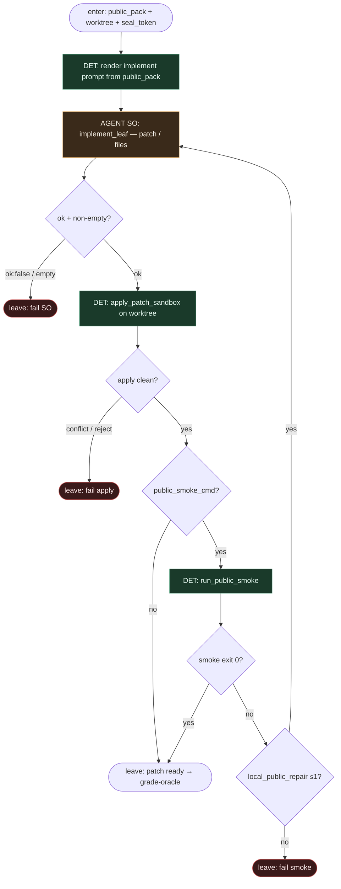

# Subgraph: implement-leaf

**Theme:** faza 2 — **jedyny** slot AGENT: wypełnij liść implement pod `public_pack`.  
**Mode mix:** AGENT SO implement; apply/smoke opc. = DET. Agent **nie** grade'uje i **nie** otwiera PR.

## Flow



## Notes

- **Agent fills implement leaf only.** Structured output; zero tool-routingu po grafie. Nie woła oracle, nie czyta `holdout/`, nie pisze `grade.json`, nie `gh pr create`.
- **Kontekst = public_pack.** Prompt buduje DET wyłącznie z issue + public fixtures. `seal_token` może być w metadanych (audit), nie jako treść testów.
- **Public smoke ≠ pass.** Opcjonalny fail-fast; zielony smoke **nie** uprawnia do ship — to robi sealed oracle.
- **Bounded local repair.** Max 1 powrót do SO na czerwony public smoke (budżet `local_public_repair`); osobno od `implement_attempts` na poziomie top-level po czerwonym oracle.
- **Meat ≡ AI.** To samo siedzenie SO.
- **Handoff.** `{patch_ref, files[], worktree, seal_token, smoke_receipt?}` → grade-oracle.

## Structured output — `implement_leaf`

```json
{
  "ok": true,
  "summary": "fix null deref in parser",
  "files": [{"path": "src/parser.py", "action": "modify"}],
  "patch_unified": "--- a/src/parser.py\n+++ b/src/parser.py\n@@ …"
}
```

`ok:false` ⇒ escape; pusty `files` / brak patcha ⇒ fail-closed.
