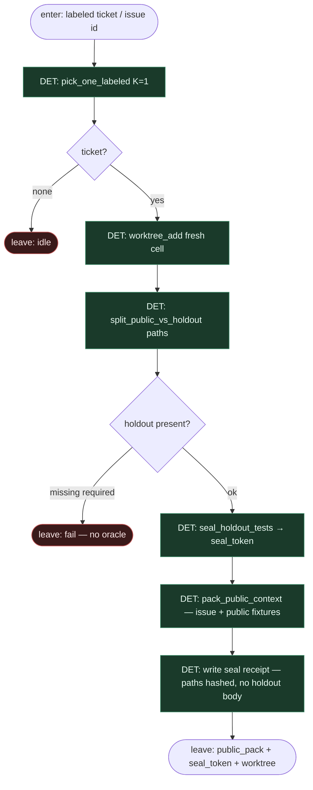

# Subgraph: seal-pack

**Theme:** faza 1 holdout-oracle — rozdziel public vs holdout, **zaplombuj** suite oceniającą, zbuduj `public_pack` dla liścia implement.  
**Mode mix:** 100% DET. Zero LLM. Agent jeszcze nie startuje.

## Flow



## Notes

- **Seal first.** Zanim jakikolwiek prompt do modelu: holdout jest poza worktree widocznym dla agenta (osobny mount / chmod / ephemeral grader volume). `seal_token` = hash ścieżek + policy id — nie treść testów.
- **Public pack only.** Issue body, acceptance criteria widoczne, opc. public smoke fixtures. Żadnych assertów z holdoutu, żadnych golden outputów z oracle.
- **Fail closed.** Brak holdout suite gdy wymaga go ticket type → skip, nie „odpalamy LLM bez grade”.
- **K=1.** Jedna komórka worktree na ticket; occupancy DET.
- **Handoff.** `{ticket, worktree, public_pack, seal_token, public_smoke_cmd?}` — **bez** holdout sources.

## Receipt (DET)

```json
{
  "seal_token": "sha256:…",
  "public_paths": ["tests/public/**"],
  "holdout_sealed": true,
  "holdout_visible_to_agent": false
}
```
