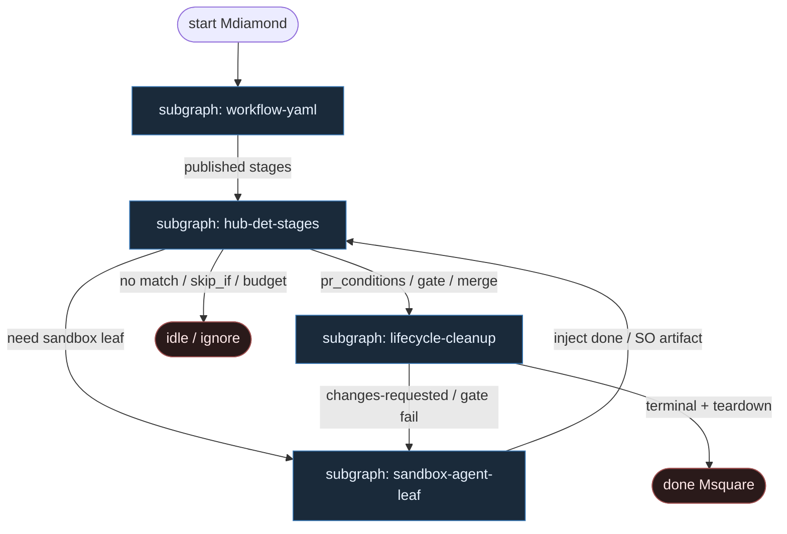

# 27 — ElasticClaw (control-plane YAML)

**Persona:** elasticclaw-compose — ElasticClaw Server = control plane; **workflow YAML stages** prowadzą ticket→PR; agenty OpenClaw są **wyłącznie liśćmi w sandboxie** (Daytona / Replicated CMX / exe.dev).

**Approach:** compose. Mapowanie [elasticclaw/elasticclaw](https://github.com/elasticclaw/elasticclaw) (WAVE1 mill / instance `elasticclaw`, conf 78, `spine_deterministic`) na duszę klepacza. **Nie** OpenClaw-as-orchestrator — gateway siedzi w liściu; hub trzyma graf.

## Design notes

- **Control plane ≠ coding agent.** ElasticClaw Server (Go, single binary): API, UI, lifecycle state, secrets, workspace publish. Orkiestracja to YAML + hub-owned triggers/gates — **0 tokenów** na wybór następnego stage.
- **Workflow YAML = program.** `.elasticclaw/workflows/*.yaml` → `elasticclaw workflow push`. Zmiana procesu = diff YAML + review, nie „agent wymyśla lane”.
- **Stages + hub-owned DET.** `pr_merged` / `pr_closed` / `pr_conditions` / `gate_result` / `run`+`gate` / `move_issue` / labels / `skip_if` / `plan_gate` — Server awansuje graf bez NLP. Chat markers (`[DONE]`) tylko UX, nie jedyny dowód CI/merge.
- **Sandbox leaf only.** Provider tworzy ephemeral workspace; Bridge łączy OpenClaw↔Server; agent dostaje inject + scoped GitHub App token. Model **nie** ewaluuje stage triggers, nie wywołuje cleanup, nie jest routerem.
- **Plan = schema gate.** Prefer `plan_gate: true` + JSON schema validator nad freeform chat-approve — jeden tor akceptacji planu.
- **Jeden ticket, jeden run.** `concurrency_group` + occupancy; K≈1 na issue. Cleanup po terminal (`merged` / `closed_no_merge`).
- **NOT L5.** Cel: zdjąć wyczerpujące klepanie; merge zostaje przy `merge_pr` policy / człowieku / Classify.

## Top-level flowchart

**DET vs AGENT at a glance**

| Layer | Mode | Responsibility |
|-------|------|----------------|
| Trigger filters (Linear/GH/Shortcut/webhook) | DET | Match labels/team/project/state → start run or ignore |
| Workflow YAML load + publish | DET | Stages graph is code; reject unknown fields |
| Hub stage triggers / `run` / `gate` / `plan_gate` | DET | First hub-owned condition wins; **0 tokens** |
| Sandbox provision + scoped GH App | DET | Provider + creds mint; no model |
| OpenClaw session in sandbox | AGENT leaf | Implement / plan artifact / optional `judge` — isolated |
| `merge_pr` / cleanup teardown | DET / HITL | Policy or human; tear sandbox after terminal |
| LLM as stage router | — | **FORBIDDEN** — hub owns next stage |

## Index of subgraphs

| File | Theme | Role in chain |
|------|--------|----------------|
| [subgraph-workflow-yaml.md](./subgraph-workflow-yaml.md) | Load/publish workflow YAML | DET front: YAML-is-code |
| [subgraph-hub-det-stages.md](./subgraph-hub-det-stages.md) | Hub-owned triggers, gates, on_enter | 0-token stage spine |
| [subgraph-sandbox-agent-leaf.md](./subgraph-sandbox-agent-leaf.md) | OpenClaw in sandbox only | Entropy leaf; not router |
| [subgraph-lifecycle-cleanup.md](./subgraph-lifecycle-cleanup.md) | PR/CI/review → terminal + teardown | Lifecycle ceiling → done |

## Compose map (ElasticClaw → klepacz)

| ElasticClaw concept | Klepacz seat |
|---------------------|--------------|
| Issue event + factory filters | label/status `ready-for-agent` → one run |
| Workspace + workflow YAML | fixed FSM ticket→PR (nie department brain) |
| Hub stage triggers (`pr_*`, `gate_result`) | DET diamonds: CI, reviews, budget, skip |
| `on_enter.run` / `gate` / `plan_gate` | DET validate / schema plan / scripts |
| Sandbox provider + Bridge | ephemeral worktree seat for leaf |
| OpenClaw agent + inject | plan / implement / bounded-fix SO leaves |
| Scoped GitHub App installation token | git/PR creds — nie szeroki PAT |
| `judge` stage | optional review SO leaf (bounded inputs) |
| `merge_pr` / terminal + cleanup | MergePolicy Off\|Classify\|Always + teardown |
| Agent choosing next stage in chat | **FORBIDDEN** |

## Kryterium sukcesu

Człowiek ma energię na architekturę i niewygodne pytania — bo trigger, stage routing, creds i cleanup nie spalają tokenów ani dnia. Technicznie: opublikowany workflow YAML doprowadza do otwartego (i opcjonalnie zmergowanego) `ai/*` PR; hub wybiera następny stage; OpenClaw w sandboxie nigdy nie jest control plane.
