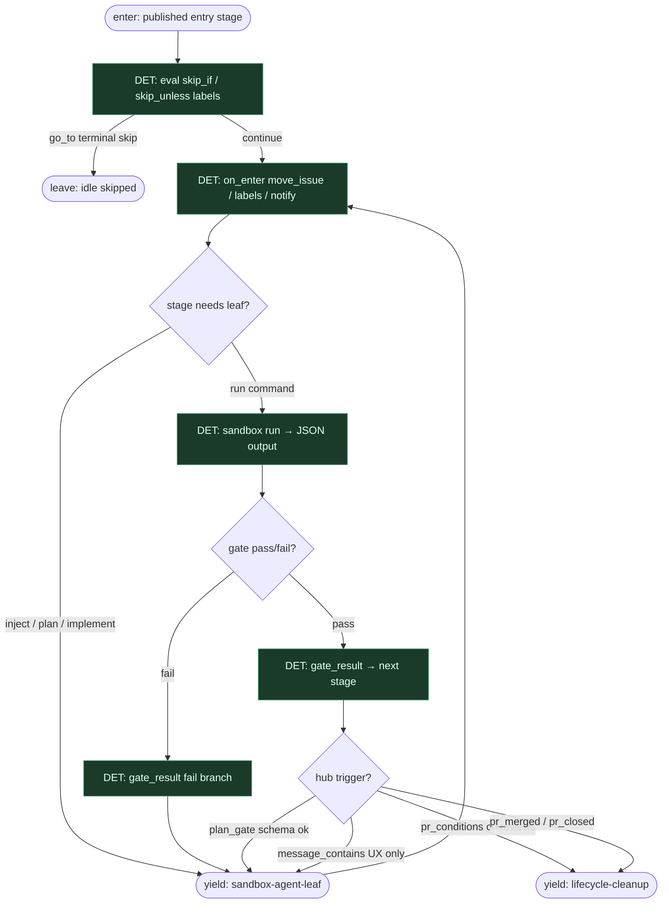

# Subgraph: hub-det-stages

**Theme:** Hub-owned stage machine — triggers, `run`/`gate`, `on_enter` bez modelu.  
**Mode mix:** DET spine. Chat markers opcjonalne UX, nie jedyny dowód.

## Flow

## Notes

- **Hub owns next stage.** `pr_merged`, `pr_closed`, `pr_conditions` (`ci`, `reviews`, `quiet_for`), `gate_result`, `output_matches`, `judge_verdict` (transition DET; verdict z wcześniejszego leaf) — Server awansuje bez NLP.
- **`run` + `gate`.** Komenda w sandboxie drukuje JSON; gate porównuje path/values. Preferuj to nad `[DONE]` jako jedyny dowód walidacji.
- **`plan_gate: true`.** Schema-only check `plan.json` → jeden tor akceptacji; wyłącza freeform chat-approve dla tego pipeline (bez double-approve).
- **`on_enter` bez czatu.** `move_issue`, `add_labels`/`remove_labels`, `merge_pr`, `notify`, `close_issue` — hub, nie model.
- **Handoff contract.** Yield leaf = `{stage_id, inject_text, outputs, creds_ref}`; yield lifecycle = `{pr_ref, policy, terminal_candidates}`.
