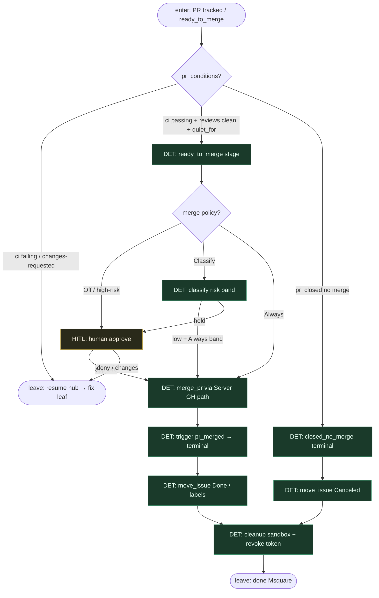

# Subgraph: lifecycle-cleanup

**Theme:** PR/CI/review ceiling → terminal stage → teardown sandbox.  
**Mode mix:** DET + opcjonalny HITL merge. Agent nie trzyma lifecycle.

## Flow

## Notes

- **Coder ceiling = open PR.** Liść implement kończy się na PR; lifecycle (CI watch, review quiet window, merge) jest hub-owned.
- **`pr_conditions`.** `ci: passing`, `reviews: clean`, opcjonalnie `quiet_for` — deterministyczny compound state, nie „agent mówi że zielone”.
- **MergePolicy Off|Classify|Always.** Domyślnie Off / HITL; `merge_pr` przez Server path gdy polityka pozwala. Nie L5 lights-out.
- **Cleanup zawsze.** Po `merged` lub `closed_no_merge`: tear-down workspace, revoke installation token, zwolnij `concurrency_group`. Wyciek sandboxa = fail ops, nie „zostaw na później”.
- **Handoff contract.** Done = `{run_id, terminal, pr_ref, issue_status, cleaned:true}`.
