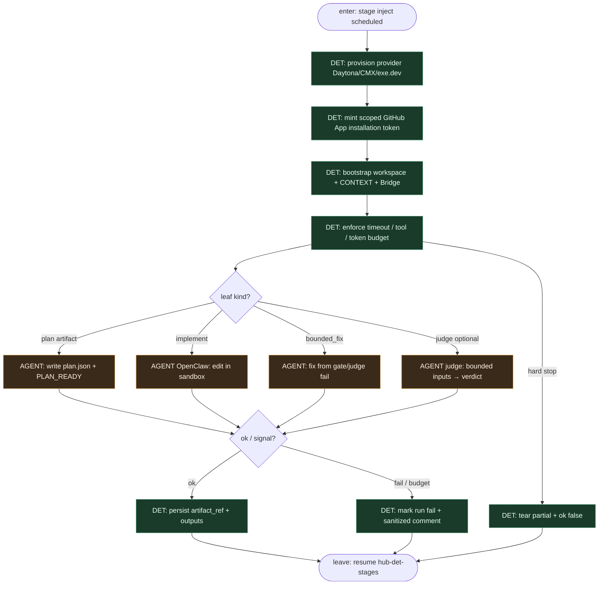

# Subgraph: sandbox-agent-leaf

**Theme:** OpenClaw w ephemeral sandbox — **jedyny** slot AGENT; liść, nie control plane.  
**Mode mix:** AGENT leaf only. Hub decyduje *kiedy*; sesja wypełnia pracę / SO.

## Flow

## Notes

- **Leaf, not brain.** OpenClaw nie ewaluuje `pr_conditions`, nie wybiera `terminal`, nie woła cleanup Servera, nie przestawia cudzych stage’y.
- **Sandbox isolation.** Provider = Daytona / Replicated CMX / exe.dev. Bridge łączy sesję z ElasticClaw Server; host control plane zostaje poza VM.
- **Scoped creds.** GitHub App → tymczasowy installation token per agent — nie szeroki PAT / user OAuth na zawsze.
- **Meat ≡ AI.** Ten sam seat `inject`+sandbox; silnik nie rozróżnia kto wypełnił artefakt.
- **Judge ≠ router.** Opcjonalny `judge` to bounded review leaf; przejście po `judge_verdict` i tak robi hub.
- **Handoff contract.** Leave = `{stage_id, ok, artifact_ref, pr_url?, reason?, usage}` → outputs dla następnego hub trigger.
