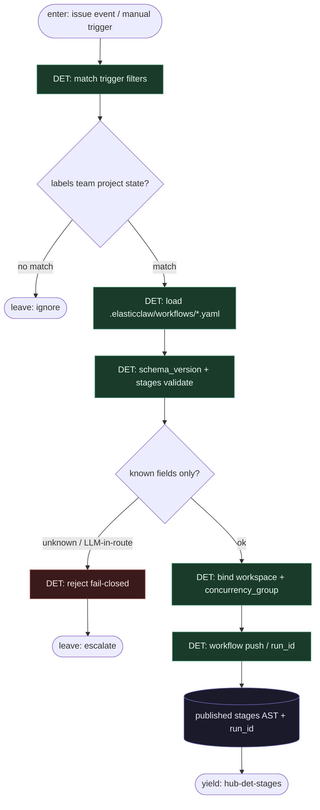

# Subgraph: workflow-yaml

**Theme:** Workflow YAML = program control plane; load + publish przed jakimkolwiek sandboxem.  
**Mode mix:** DET only. Zero tokenów na spine.

## Flow

## Notes

- **YAML-is-code.** Topologia żyje w `.elasticclaw/workflows/` wersjonowanym w PR. `elasticclaw workflow push` publikuje do workspace — zmiana lane’u = diff, nie chat-loop.
- **Trigger = filtr fabryki.** Linear `status_changed` / GH `issue_labeled` / Shortcut / webhook + `labels` / `exclude_labels` / team / project. Brak match → ignore (nie „agent wybiera kolejkę”).
- **Allowed surface (klepacz subset):** `trigger`, `stages[]` (`id`, `entry`, `triggers`, `on_enter`, `gate`, `plan_gate`, `skip_if`, `terminal`), `concurrency_group`, `provider`, `secret_refs`. Wyrażenie „next stage = model decides” → reject.
- **One run per ticket.** `concurrency_group` + occupancy zanim yield; nie fan-out katalogu Issues w środku YAML.
- **Handoff contract.** Yield hub-det-stages = `{workflow_ast, run_id, workspace_id, entry_stage, vars}`.
