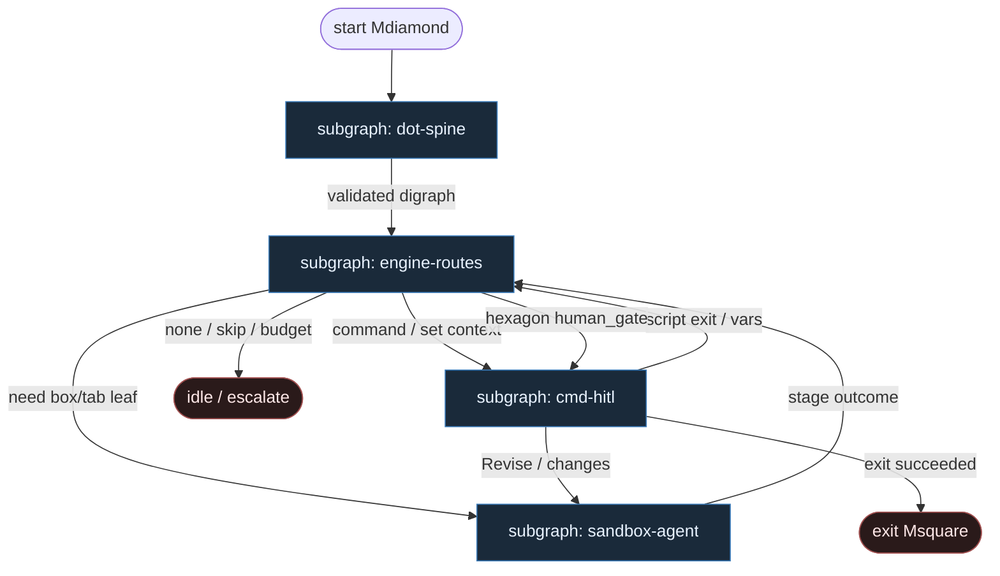

# 28 — Fabro DOT (fabro.sh compose)

**Persona:** fabro-dot compose — [fabro.sh](https://fabro.sh/): workflow w Graphviz DOT (`.fabro`); **silnik** wybiera następny węzeł (edge `condition` / label / weight); LLM **tylko** w liściach `box`/`tab`, a tool-calling agenta tylko **w sandboxie**.

**Approach:** compose. Mapowanie Fabro Language (docs.fabro.sh) na duszę klepacza (ticket→PR, nie L5). Graph-is-code; agent is sandbox leaf. **Nie** alias 14-dot-pipeline (Attractor PipelineRunner) — tu: `fabro run` + sandbox providers.

## Design notes

- **DOT = program.** `fabro run ticket-to-pr.fabro` — digraph z `goal`, dokładnie jednym `start` (Mdiamond) i jednym `exit` (Msquare). Zmiana procesu = edycja DOT + validate — nie „agent wymyśla co dalej”.
- **Silnik decyduje o next node.** Po stage outcome Fabro ewaluuje wychodzące krawędzie (`outcome=…`, `context.KEY`, `preferred_label`, weight). **0 tokenów** orkiestracji. LLM nie jest routerem.
- **Agenci tylko w sandbox leaves.** `shape=box` (multi-turn + tools) i `shape=tab` (one-shot prompt, bez tools) — tool loop / bash / edit **wewnątrz** sandboxa (`docker` | `local` | `daytona`). Poza liściem: command / conditional / human / start / exit.
- **Shape → handler (kanon Fabro → klepacz).**
  - `parallelogram` + `script` — DET command (pick, worktree, test, git, open PR, merge)
  - `diamond` — DET conditional (tests_ok, occupancy, budget, clarify)
  - `box` — agent leaf w sandboxie (implement / bounded repair)
  - `tab` — prompt leaf (plan SO / review SO — bez tool loop)
  - `hexagon` — HITL (Approve plan, MergePolicy Off)
  - `Mdiamond` / `Msquare` — start / exit
- **Klepacz, nie dark factory.** Blueprint = labeled issue → worktree → plan → implement → test → open PR → review → merge policy — nie research→SSG theatre.
- **Meat ≡ AI w liściu.** To samo siedzenie; silnik nie rozróżnia kto wypełnił outcome.
- **NOT L5.** Cel: zdjąć wyczerpujące klepanie; człowiek zostaje przy architekturze, trudnych decyzjach i (gdy Off) merge.
- **Jeden ticket, jeden PR.** K=1; `max_visits` / `loop_restart_signature_limit` boundują implement↔test.
- **Fail closed.** Czerwony test / `outcome=failed` / brak labela → bounded edge back albo exit — nie gruby mózg „napraw wszystko”.

## Top-level flowchart

**DET vs AGENT at a glance**

| Layer | Mode | Responsibility |
|-------|------|----------------|
| `.fabro` load + validate | DET | Parse digraph; exactly one start/exit; reject unknown handlers |
| Engine edge selection | DET | `condition` / label / weight → **next node**; 0 tokens |
| `parallelogram` command | DET | pick_one_labeled, worktree, pytest, commit, push, open_pr, merge_policy |
| `diamond` conditional | DET | tests_ok, occupancy, clarify, attempt budget |
| `box` / `tab` | AGENT leaf | plan / implement / review — **sandbox only** for tools |
| `hexagon` | HITL | Approve / MergePolicy Off — nie LLM judge |
| LLM picks next node | — | **FORBIDDEN** — engine owns transitions |

## Index of subgraphs

| File | Theme | Role in chain |
|------|--------|----------------|
| [subgraph-dot-spine.md](./subgraph-dot-spine.md) | Load + validate `*.fabro` digraph | DET front: DOT-is-code |
| [subgraph-engine-routes.md](./subgraph-engine-routes.md) | Engine edge selection | 0-token next-node spine |
| [subgraph-sandbox-agent.md](./subgraph-sandbox-agent.md) | `box`/`tab` leaves in sandbox | Entropy slot; not router |
| [subgraph-cmd-hitl.md](./subgraph-cmd-hitl.md) | command + hexagon + exit | DET plumbing + HITL → exit |

## Compose map (Fabro → klepacz)

| Fabro concept | Klepacz seat |
|---------------|--------------|
| `fabro run workflow.fabro` | daemon tick / GHA: labeled issue → one run |
| digraph + `goal=` | fixed FSM ticket→PR (nie department brain) |
| edge `condition` / weight | DET diamonds: tests_ok, occupancy, clarify, budget |
| `shape=box` agent | implement / repair — tools **in sandbox** |
| `shape=tab` prompt | plan_issue / pr_review SO (no tools) |
| `shape=parallelogram` + `script` | pick, worktree, pytest, git, open_pr, merge |
| `shape=hexagon` | Approve plan / MergePolicy Off |
| sandbox `docker`\|`local`\|`daytona` | izolacja tool loop; `fabro ssh` tylko HITL debug |
| `max_visits` / failure signature limit | bounded implement↔test; no infinite limbo |
| LLM in edge condition | **FORBIDDEN** |
| Attractor PipelineRunner | **out of scope** (inny stack — wariant 14) |

## Przykładowy szkielet `.fabro` (klepacz)

```dot
digraph TicketToPr {
  graph [goal="One labeled issue → open ai/* PR; merge by policy"]
  rankdir=LR

  start [shape=Mdiamond, label="Start"]
  exit  [shape=Msquare, label="Exit"]

  pick      [shape=parallelogram, label="Pick", script="gh issue list --label ready-for-agent -L 1"]
  worktree  [shape=parallelogram, label="Worktree", script="./scripts/worktree_add.sh"]
  plan      [shape=tab, label="Plan", prompt="Plan issue; emit SO: goal, files, test_command, stop_if"]
  approve   [shape=hexagon, label="Approve plan"]
  implement [shape=box, label="Implement", class="coding",
             prompt="Implement approved plan in worktree only", max_visits=3]
  test      [shape=parallelogram, label="Test", script="pytest -q", goal_gate=true]
  gate      [shape=diamond, label="Tests OK?"]
  open_pr   [shape=parallelogram, label="Open PR", script="./scripts/open_pr.sh"]
  review    [shape=tab, label="Review", prompt="Critical review; verdict approve|changes|reject"]
  merge_g   [shape=hexagon, label="MergePolicy"]

  start -> pick -> worktree -> plan -> approve
  approve -> implement [label="Approve"]
  approve -> plan      [label="Revise"]
  implement -> test -> gate
  gate -> open_pr [condition="outcome=succeeded"]
  gate -> implement [label="Fix", condition="outcome=failed"]
  open_pr -> review -> merge_g
  merge_g -> exit [label="Always/Classify ok"]
  merge_g -> implement [label="changes"]
}
```

## Kryterium sukcesu

Człowiek ma energię na architekturę i niewygodne pytania — bo routing i git/PR nie spalają tokenów ani dnia. Technicznie: `fabro run` przechodzi digraph do otwartego (i opcjonalnie zmergowanego) `ai/*` na tipie hosta; **silnik** wybiera następny węzeł; agent nigdy nie jest routerem i tooluje tylko w sandboxie.
