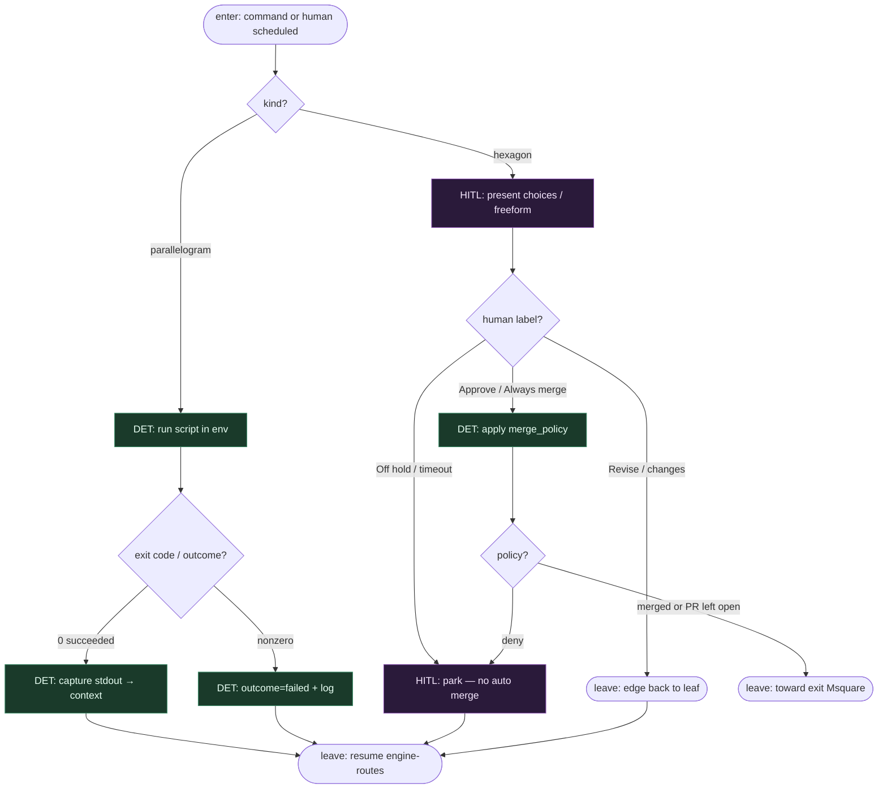

# Subgraph: cmd-hitl

**Theme:** `parallelogram` command + `hexagon` human + polityka merge → exit.  
**Mode mix:** DET plumbing + HITL. Zero LLM.

## Flow

## Notes

- **Command = DET atom.** `script=` → pick_one_labeled, worktree_add, pytest, commit, push, open_pr, merge_policy exec — bez modelu.
- **Human = hexagon.** Edge `label` = opcje (Approve / Revise / Always / Off). Timeout → `human.default_choice` albo park; nie „LLM zgaduje zgodę”.
- **MergePolicy Off|Classify|Always.** Always/Classify mogą iść DET po review; Off = hexagon trzyma przycisk.
- **Coder ceiling = open PR.** Implement leaf nie merjuje; open_pr + merge to command/HITL.
- **goal_gate na testach.** Czerwony test może zablokować sukces runu mimo dojścia do exit.
- **Handoff contract.** Leave = `{outcome, context_patch, preferred_label?}` → engine-routes albo exit.
