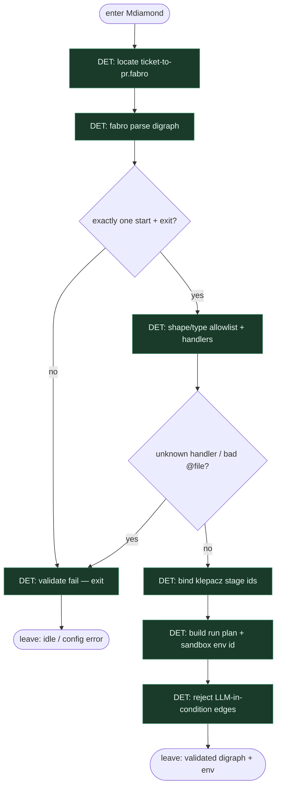

# Subgraph: dot-spine

**Theme:** załaduj i zwaliduj `*.fabro` digraph — DOT jest kodem.  
**Mode mix:** 100% DET. Zero LLM.

## Flow

## Notes

- **Graph-is-code.** Zmiana procesu = edycja `.fabro`, nie prompt „zrób inaczej dziś”.
- **Validate bez API key.** Zły shape / brak start-exit / martwy `@prompts/…` / nieznany handler = fail przed pierwszym liściem.
- **Shape allowlist (klepacz).** Mdiamond, Msquare, box, tab, parallelogram, diamond, hexagon; opcjonalnie component/tripleoctagon. `house` manager_loop — zwykle **out** (nie department brain).
- **Bind do klepacza.** Stage ids → `pick_one_labeled`, `worktree_add`, `plan_issue`, `implement`, `run_tests`, `open_pr`, `pr_review`, `merge_policy` — nie research/SSG.
- **Sandbox env.** Run config wybiera `docker` | `local` | `daytona` **przed** pierwszym boxem — agenci nie wybierają hosta.
- **Handoff contract.** Output = `{dot_ast, stage_bind, sandbox_env, run_id}` dla engine-routes.
