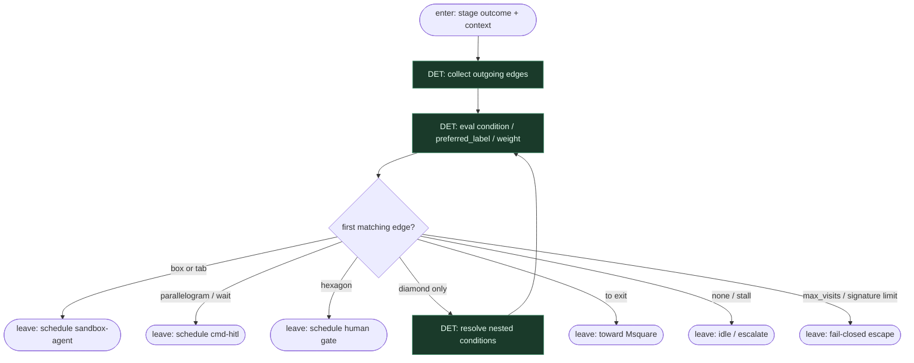

# Subgraph: engine-routes

**Theme:** Fabro engine wybiera **następny węzeł** — 0 tokenów orkiestracji.  
**Mode mix:** 100% DET. Zero LLM w routingu.

## Flow

## Notes

- **Engine owns next.** Po `succeeded` / `failed` / `partially_succeeded` / `skipped` silnik ewaluuje `condition` (`outcome=…`, `context.KEY`, `preferred_label`). LLM **nie** woła „następnego toola ze świata”.
- **0 tokenów.** Routing = wyrażenie + weight tiebreak (`selection=deterministic` default) — jak Jinja w Conductorze, tu natywne Fabro.
- **Loops OK, ale bound.** `implement → test → gate → implement` z `max_visits` / `loop_restart_signature_limit` — bez nieskończonego limbo.
- **goal_gate.** Czerwony test z `goal_gate=true` może oblać run nawet przy dojściu do exit — fail closed.
- **Nie mylić z agent routing schema.** `output_schema="routing"` w Fabro to opcjonalny leaf hint; w klepaczu **preferujemy** czyste DET conditions — SO review/plan nie steruje topologią.
- **Handoff contract.** Leave = `{next_node_id, edge_label?, reason}` → sandbox-agent | cmd-hitl | exit.
