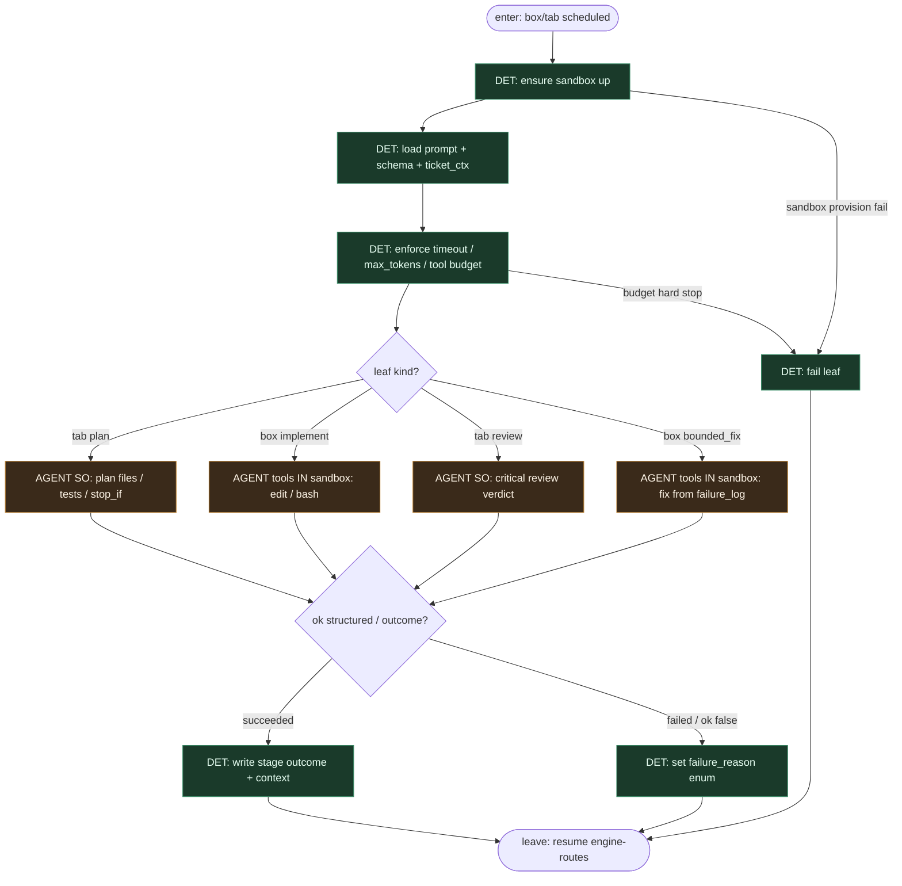

# Subgraph: sandbox-agent

**Theme:** `box` / `tab` — **jedyny** slot LLM; tools **tylko w sandboxie**; nie router.  
**Mode mix:** AGENT leaf only. Engine decyduje *kiedy*; sandbox izoluje tool loop.

## Flow



## Notes

- **Sandbox leaf, not brain.** Model nie ewaluuje edge conditions, nie wybiera `exit`, nie merjuje, nie przestawia label FSM.
- **Providers.** `docker` (default) | `local` | `daytona` — tool bash/edit tylko wewnątrz; host merge/gh zostaje w `parallelogram` poza agentem (albo świadomie w sandboxie z network policy).
- **box vs tab.** `box` = multi-turn + tools (implement/repair). `tab` = one-shot prompt bez tools (plan/review SO) — mniejsza entropia, łatwiejszy audit.
- **Reviewer ≠ implementer.** Osobne węzły / osobne sesje; nigdy self-stamp. Opcjonalnie `thread_id` tylko w cluster implement — nie łączyć z review.
- **Meat ≡ AI.** Ten sam leaf seat; silnik nie rozróżnia kto wypełnił outcome.
- **ok:false / failed bez limbo.** underspecified | too_large | dangerous | cant_comply → engine bierze edge Fix/skip/exit.
- **Handoff contract.** Leave = `{node_id, outcome, context_updates?, usage}` → engine-routes.

## Structured output (skrót)

```json
{ "ok": true, "goal": "...", "files": ["..."], "test_command": "...", "non_goals": ["..."], "stop_if": ["auth","migration"] }
```

```json
{ "ok": true, "summary": "...", "files_touched": ["..."], "tests_run": true }
```

```json
{ "verdict": "approve"|"changes"|"reject", "reasons": ["..."], "risk": "low"|"high" }
```
