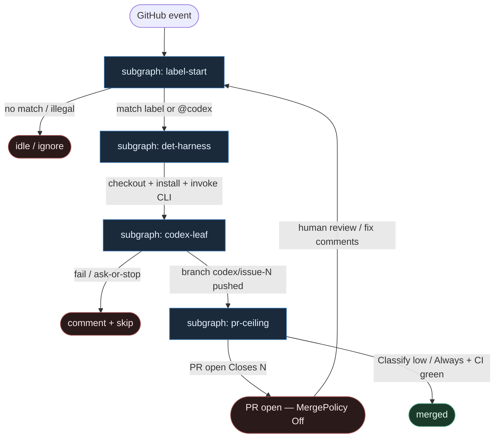

# 29 — Codex Auto reuse (CLI in Actions)

**Persona:** `codex-auto-reuse` — maksymalna wierność wzorca **OpenAI Codex CLI w GitHub Actions**: **label → DET harness (Actions) → `codex` CLI leaf → PR**. Agenty są **liśćmi**; YAML + skrypt = program.

**Approach:** `reuse_ready`. Nie wymyślamy nowego orkiestratora — bierzemy non-interactive Codex CLI (`codex exec` / headless) uruchamiany ze stałego workflow GHA i rozkładamy na podgrafy DET-majority zgodne z SOUL / KLEPACZ / ready-for-agent.

## Design notes

- **Label = start.** `issues.labeled` (np. `ready-for-agent` / `codex` / `do`), opc. `issue_comment` z `@codex`, albo `workflow_dispatch`. Zero agent pick z czatu / unlabeled backlogu.
- **DET harness = spine.** Fixed GHA: `checkout` → permissions → install/wire Codex CLI → `codex exec` z template prompt → (opc.) open PR. Kolejność stała; LLM nie routuje jobów ani nie dopisuje `steps:`.
- **Codex CLI = liść AGENT.** Entropy tylko wewnątrz procesu CLI (implement). CLI nie wybiera następnego węzła grafu — kończy się artefaktem (diff / branch / fail).
- **Branch `codex/issue-N`.** Konwencja reuse: jedna misja = jeden branch nazwany po issue. K=1 occupancy per ticket.
- **Coder ceiling = open PR.** Harness + CLI dochodzą do PR `Closes #N`. Merge = polityka DET / człowiek (domyślnie **Off**).
- **DET majority.** Trigger parse, `if:` guard, checkout, secrets, CLI install/flags, branch push plumbing, PR create, CI wait — skrypty / GHA. AGENT tylko w liściu `codex`.
- **Meat ≡ AI.** To samo siedzenie w łańcuchu; graf się nie zmienia gdy liść wypełnia człowiek-klepacz vs Codex.
- **NOT L5.** Zdejmujemy babysitting issue→PR w CI runnerze. Nie lights-out bank, nie „wyrzuć inżyniera”.
- **Cel (SOUL):** człowiek ma energię na architekturę — bo nie spalił dnia na ticket→branch→push→PR.

## Top-level flowchart

**DET vs AGENT at a glance**

| Layer | Mode | Skąd (reuse) | Uwaga |
|-------|------|--------------|-------|
| Label / `@codex` / dispatch | DET | GHA `on:` + `if:` | agent nie wybiera pracy |
| checkout, perms, secrets, CLI install | DET | fixed workflow YAML = harness | spine bez LLM |
| `codex exec` (headless CLI) | AGENT leaf | OpenAI Codex CLI | entropy tylko tu |
| branch `codex/issue-N` | DET convention | harness + gh | K=1 per issue |
| open PR `Closes #N` | DET | gh / post-step | coder ≠ merge |
| Merge Off\|Classify\|Always | DET policy | KLEPACZ / ready-for-agent | default Off |

## Index of subgraphs

| File | Theme | Role in chain |
|------|--------|----------------|
| [subgraph-label-start.md](./subgraph-label-start.md) | label / @codex / event | DET trigger gate |
| [subgraph-det-harness.md](./subgraph-det-harness.md) | fixed GHA + CLI wiring | DET Actions harness |
| [subgraph-codex-leaf.md](./subgraph-codex-leaf.md) | Codex CLI leaf | jedyny AGENT entropy sink |
| [subgraph-pr-ceiling.md](./subgraph-pr-ceiling.md) | PR + merge policy | coder ceiling; merge DET/human |

## Mapowanie Codex Auto → klepacz

| Codex / GHA | Klepacz seat |
|-------------|--------------|
| `on: issues.labeled` / `issue_comment` | subgraph-label-start |
| job `steps:` checkout + install + flags | subgraph-det-harness |
| `codex exec` / headless Codex CLI | subgraph-codex-leaf (AGENT) |
| branch `codex/issue-N` | leaf output → DET convention |
| open PR referencing issue | subgraph-pr-ceiling |
| human merge / policy | MergePolicy Off (default) |
| agent as workflow router | **FORBIDDEN** |

## Antyteza (czego tu nie ma)

- Agent wybierający pracę z czatu / unlabeled backlogu
- LLM routujący kolejne joby GHA („co dalej w YAML”)
- Monolit: merge wewnątrz CLI jako jedyna ścieżka
- L5 lights-out / wymyślanie ticketów
- Współdzielony dirty tree poza runnerem (runner = świeża komórka)
- Interactive TTY Codex jako orkiestrator fabryki

## Kryterium sukcesu

Technicznie: branch `codex/issue-N` + otwarty (opc. zmergowany) PR na tipie hosta. Ludzko: inżynier nie babysittował issue→PR — energia na architekturę i niewygodne pytania QA.
