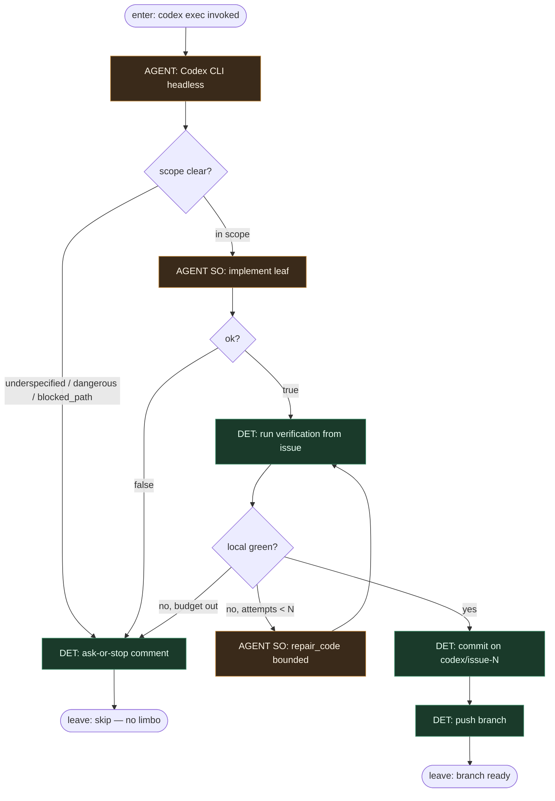

# Subgraph: codex-leaf

**Theme:** OpenAI Codex CLI (`codex exec`) jako **liść AGENT** — implement; nie orkiestrator.  
**Mode mix:** AGENT tylko w procesie CLI; branch name + stop + verify = DET konwencja / harness.

## Flow

## Notes

- **Reuse fidelity.** Codex Auto = headless CLI w Actions: czyta issue, edytuje pliki, kończy. To nadal **liść** — nie flipuje stage-labeli fabryki ani merge policy.
- **Branch `codex/issue-N`.** Stała konwencja nazwy; jeden ticket → jeden branch. Occupancy DET w harness przed invoke.
- **Liść, nie orkiestrator.** Codex nie decyduje „uruchom następny workflow” ani „zmień MergePolicy”. Wynik = diff + branch / fail.
- **Ask-or-stop.** Auth, billing, migracje, deps poza Allowed → comment + stop (KLEPACZ), nie „ulepsz po drodze”.
- **Meat ≡ AI.** To samo siedzenie: headless Codex w CLI albo człowiek-klepacz w tym samym runner contract — graf bez zmian.
- **Bounded.** CLI flags / max turns / sandbox = budżet DET wokół liścia; wyczerpanie → skip + evidence.
- **Kontrakt SO (WORKING_KLEPACZ_GRAPH):** implement `{ok, summary, files_touched, tests_run}` — fail = `{ok:false, reason:enum}`.
- **Handoff contract.** `{branch: codex/issue-N, shas[], summary}` \| `{skip, reason}`.
