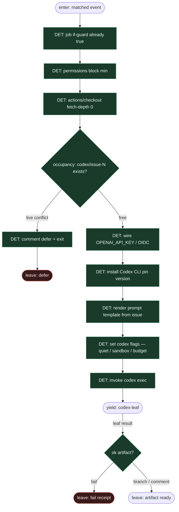

# Subgraph: det-harness

**Theme:** stały YAML GHA + wiring Codex CLI = **deterministyczny harness**; kroki nie są wybierane przez LLM.  
**Mode mix:** 100% DET. `codex exec` jest *wywoływany*, nie orkiestruje jobów.

## Flow

## Fixed step table (compose)

| # | Step | Who | Notes |
|---|------|-----|-------|
| 1 | `if:` label / `@codex` | DET | już z label-start |
| 2 | `permissions:` least privilege | DET | contents/PRs/issues write tylko gdy issue→PR |
| 3 | `actions/checkout@v4` | DET | świeża komórka runnera = worktree |
| 4 | secret / OIDC wire | DET | `OPENAI_API_KEY` never in prompt body |
| 5 | install Codex CLI (pinned) | DET | npm/binary pin — reprodukowalność |
| 6 | prompt template + CLI flags | DET | `--quiet` / sandbox / max turns |
| 7 | `codex exec` | invoke leaf | headless; nie TTY chat |
| 8 | post: receipt / defer comment | DET | fail closed |

## Notes

- **YAML + skrypt = program.** Kolejność kroków jest stała — jak Temporal Workflow body / label-FSM spine. Model nie dopisuje `steps:`.
- **Harness ≠ agent.** Instalacja, pin wersji, flagi, env, occupancy check — czysty DET wokół liścia.
- **Runner = fresh cell.** Efekt fresh worktree z ready-for-agent: czysty checkout per run, K=1 na ticket.
- **Prompt = template, nie router.** Prompt wypełniany z issue payload (In/Out/Ask-or-stop); nie „zdecyduj co robić w fabryce”.
- **Permissions cynic.** Issue→PR → contents + pull-requests write. Bez zbędnych uprawnień.
- **Handoff.** Yield codex-leaf = `{issue_id, workspace, prompt_ref, branch_target: codex/issue-N, cli_flags}`.
