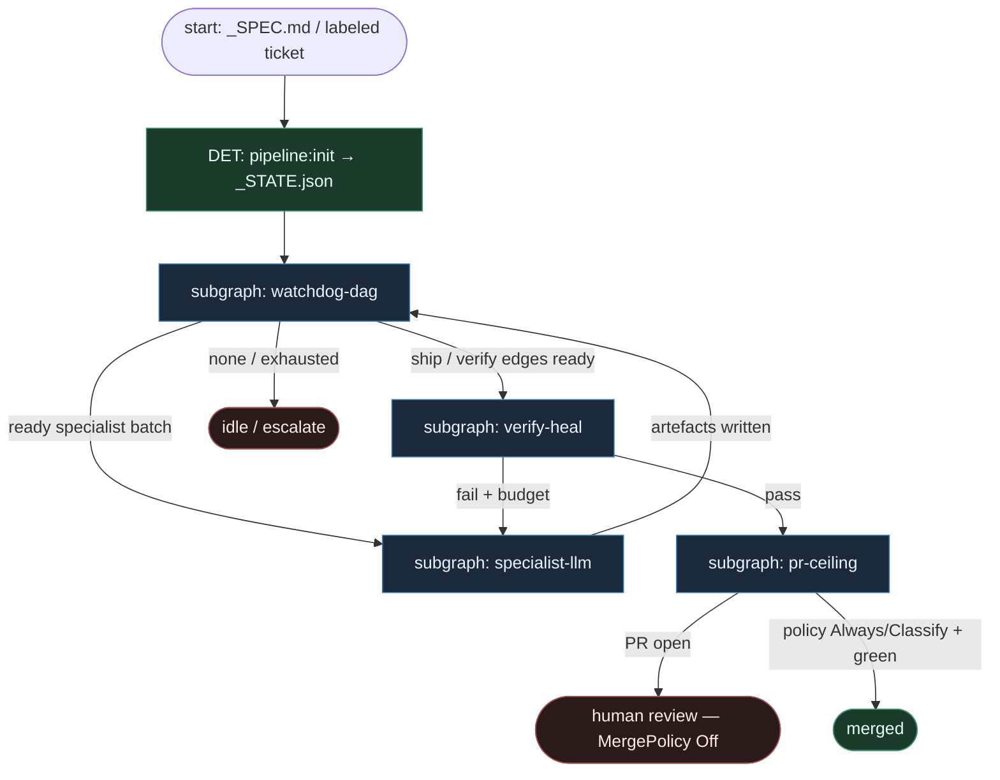

# 30 — DAGent DAG (compose)

**Persona:** dagent-dag compose — **explicytny TypeScript DAG watchdog**; LLM **tylko** w węzłach specjalistów; push / poll-ci / live verify / triage = DET.

**Approach:** compose. Mapowanie [rkaliupin/DAGent](https://github.com/rkaliupin/DAGent) (autonomous-factory, Stripe Minions–zbieżny) na duszę klepacza: ticket/spec → przetestowany PR, **nie** L5 Azure theatre.

## Design notes

- **Watchdog jest DET.** `while` + `getNextAvailable(DAG)` w TypeScript czyta `_STATE.json`, wybiera gotową paczkę węzłów, zapisuje wyniki. Zero LLM w orkiestracji — graf już jest kodem.
- **LLM only in specialist nodes.** ~plan / implement / triage-diagnosis / review SO żyją **w** boxach specjalistów. Nie wybierają następnego węzła; zwracają artefakt + `ok`.
- **Stan = `_STATE.json` + DAG readiness.** Crash / restart = wczytaj stan, nie „pamiętaj w context window”.
- **Shell bypass bez modelu.** `push-code`, `poll-ci` (GHA deploy), integration + live-ui (Playwright) = parallelogram DET. Constitutional wrappers na git OK.
- **Bounded self-heal.** Fail live/CI → `TriageDiagnostic` (LLM leaf) + `reset` węzłów ≤5 (circuit breaker) → z powrotem do watchdog. Po limicie → escalate / skip, nie nieskończona pętla.
- **Coder ceiling = `create-pr`.** Cleanup + docs + open PR; **stop** na review człowieka. MergePolicy domyślnie **Off**.
- **Klepacz-kształt, nie full feature mill.** Trigger = labeled issue **albo** `_SPEC.md` zmapowany na ticket; jedna misja = jeden PR. DevContainer/Azure sample zostaje opcjonalnym hostem — nie wymogiem duszy.
- **Meat ≡ AI w specialist seat.** To samo siedzenie; watchdog nie rozróżnia.
- **NOT L5.** Zdjąć wyczerpujące klepanie (branch→push→CI babysit→PR); człowiek zostaje przy architekturze, trudnych decyzjach i review merge.
- **Jeden ticket / jeden spec, jeden PR.** K=1; watchdog nie sieje katalogu feature’ów w jednym runie klepacza.

## Top-level flowchart

**DET vs AGENT at a glance**

| Layer | Mode | Responsibility |
|-------|------|----------------|
| `pipeline:init` / `_STATE.json` | DET | Bind ticket/spec, seed DAG nodes, readiness |
| TypeScript watchdog `getNextAvailable` | DET | Batch schedule, checkpoint, no LLM |
| Specialist nodes (plan/implement/triage/review) | AGENT SO | LLM fills node only |
| push-code / poll-ci / integration / live-ui | DET | Shell + CI; model bypass |
| Triage reset counter ≤5 | DET gate + optional LLM triage leaf | Circuit breaker |
| create-pr / cleanup / docs | DET (+ optional thin LLM docs leaf) | Coder ceiling |
| Human PR review / MergePolicy | HITL / DET policy | Default Off — not auto-merge |

## Index of subgraphs

| File | Theme | Role in chain |
|------|--------|----------------|
| [subgraph-watchdog-dag.md](./subgraph-watchdog-dag.md) | TS while + DAG + `_STATE.json` | DET spine / scheduler |
| [subgraph-specialist-llm.md](./subgraph-specialist-llm.md) | Specialist agent nodes | Jedyny sink entropii LLM |
| [subgraph-verify-heal.md](./subgraph-verify-heal.md) | push → CI → live + triage≤5 | DET verify + bounded heal |
| [subgraph-pr-ceiling.md](./subgraph-pr-ceiling.md) | cleanup → create-pr → HITL | Coder ceiling; merge Off |

## Compose map (DAGent → klepacz)

| DAGent concept | Klepacz seat |
|----------------|--------------|
| `_SPEC.md` + `npm run agent:run` | labeled `ready-for-agent` **lub** spec file → `pipeline:init` |
| `_STATE.json` + DAG | checkpoint misji; source of truth |
| Watchdog `getNextAvailable` | daemon tick / fixed scheduler (nie department brain) |
| ~12 specialist agents / 4 phases | thin SO leaves: plan, implement, triage, pr_review |
| `push-code` shell bypass | DET git push atom |
| `poll-ci` GHA deploy | DET CI babysit (bounded) |
| integration-test + live-ui Playwright | DET verify gate (host-appropriate tests) |
| TriageDiagnostic + reset ≤5 | bounded repair; fail closed |
| code-cleanup → docs → `create-pr` | coder ceiling = open PR |
| PR for human review | MergePolicy **Off** default |
| LLM in watchdog / choosing next DAG node | **FORBIDDEN** |
| Full Azure Functions + DevContainer mill | optional host — nie wymóg duszy |

## Antyteza (czego tu nie ma)

- Agent jako router grafu / „co dalej w DAG”
- Jeden gruby mózg tool-calling orkiestrujący całą fabrykę
- Nieskończony self-heal bez circuit breakera
- Auto-merge z wewnątrz `create-pr`
- L5 lights-out / discovery ticketów z czatu
- Wymóg Azure sample jako jedynej ścieżki klepacza

## Kryterium sukcesu

Człowiek ma energię na architekturę i niewygodne pytania — bo watchdog + DET CI zdejmują klepanie. Technicznie: `_STATE.json` prowadzi do otwartego `ai/…` PR na tipie hosta; LLM nigdy nie wybiera następnego węzła DAG.
